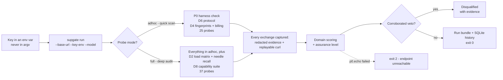

# VERITAS

**Ask your AI supplier hard questions — and get evidence-backed answers.**

VERITAS is a supplier-assurance toolkit that treats any OpenAI-compatible
endpoint like a black box and interrogates it: is it really the model you paid
for? Is it quietly proxying through someone else? Is it inflating your bill?
The `supgate` CLI runs a manifest-driven probe catalog, scores every domain,
and writes a run bundle with redacted evidence you can inspect and replay.

## How a run works



The bundle is the contract. Every verdict — pass, warn, fail, skip — carries
notes, evidence references, and a redacted curl, so nothing is a bare assertion.

## What it checks

| Domain | What the probes look for |
| --- | --- |
| **P0** | Harness self-check: is the endpoint alive, which models does it claim, does it reject bad keys cleanly |
| **D6** | Protocol compliance: SSE framing, JSON mode, tool passthrough, vision, idempotency, usage fields, Responses API |
| **D4** | Relay fingerprints: response headers, id families, model echo, self-report, canary integrity, SSE timing, backend rotation |
| **D4** | Billing forensics: tiktoken recount vs reported usage, hidden prompt offsets, reasoning/cache field consistency |
| **D2** (full) | Load matrix: TTFT/TPOT/ITL/E2E percentiles across three input bands, client-SLA goodput, 30K-token needle recall |
| **D8** (full) | Capabilities: six tool-call modes, strict structured output, reasoning, knowledge-cutoff battery, prompt caching |

Four disqualifying vetoes fire only on corroborated evidence: `reverse_identity`,
`substitution`, `billing_inflation`, and `hidden_origin`.

## Quick start

Python >= 3.11. PowerShell:

```powershell
py -3.11 -m venv .venv
.\.venv\Scripts\Activate.ps1
python -m pip install -e ".[dev]"
```

Linux/WSL:

```bash
python3 -m venv .venv
source .venv/bin/activate
python -m pip install -e ".[dev]"
```

Keys are **env-only** — never on the command line. Set one, then reference it
by name:

```powershell
$env:SUPGATE_KEY = "sk-..."                      # env-only key
supgate run `
  --base-url "https://api.supplier.example/v1" `
  --key-env SUPGATE_KEY `
  --model "gpt-4o" `
  --mode adhoc
```

`--base-url`, `--key-env`, and at least one `--model` are required.

| Option | Default | Notes |
| --- | --- | --- |
| `--mode` | `adhoc` | `adhoc` (25 probes) or `full` (37 probes) |
| `--out` | `runs` | Bundle + evidence directory |
| `--sla` | defaults | Client SLA, e.g. `--sla ttft=5,tpot=0.5,e2e=60` |
| `--budget-usd` | unlimited | Per-run cost cap; blocks further probes when hit |
| `--concurrency` | `10` | Max concurrent probes, 1..50 |
| `--timeout-s` | `60` | Positive HTTP timeout in seconds |

Operator examples (keys remain env-only):

```powershell
# Run: progress + final summary; add --json for one machine-readable summary.
supgate run --base-url $Endpoint --key-env SUPGATE_KEY --model gpt-4o `
  --budget-usd 5 --timeout-s 30 --json

# Default p0.echo failure fast-stops endpoint work; opt into full collection:
supgate run --base-url $Endpoint --key-env SUPGATE_KEY --model gpt-4o `
  --budget-usd 5 --timeout-s 30 --continue-forensics
```

## Official baselines

Baselines calibrate D4 probes against a reference endpoint you trust. The key
and endpoint are explicit every run — no shared defaults, no `SUPGATE_OFFICIAL_BASE_URL`:

```powershell
$env:MY_OFFICIAL_KEY = "sk-..."                       # fresh per session
supgate baseline record --vendor openai --model gpt-4o `
  --endpoint https://api.openai.com/v1 --key-env MY_OFFICIAL_KEY `
  --budget-usd 5 --dry-run --json
supgate baseline record --vendor openai --model gpt-4o `
  --endpoint https://api.openai.com/v1 `
  --key-env MY_OFFICIAL_KEY --budget-usd 5 --confirm-official
supgate baseline list
supgate baseline show BL-OPENAI-GPT-4O-0001
supgate baseline select --model gpt-4o
```

Runs auto-select exact baselines from `baselines/`; family and coarse matching
are opt-in via `--allow-family-baseline` / `--allow-coarse-baseline`.

## Outputs and evidence

Each run writes under `--out` (default `runs/`):

- **`SUP-YYYYMMDD-XXXX.json`** — schema-2 run bundle: identity, versions,
  tokenizer cost, baseline provenance, scores, assurance, vetoes, and one
  evidence-backed result per probe. The bundle records the key source env
  name and a one-way SHA-256 **key fingerprint** (`key_env` /
  `key_fingerprint`) so artifacts are traceable to the exact key — the raw
  key is never stored.
- **`evidence/SUP-YYYYMMDD-XXXX/`** — one JSON file per request/response
  exchange. API keys become `sk-abc****WXYZ` stubs and the `Authorization`
  header becomes `Bearer $SUPGATE_KEY`, so artifacts are safe to share. Each
  exchange ships a reproducible redacted `curl` for replaying failures.

History lives in `~/.supgate/history.db`:

```powershell
supgate history --endpoint https://api.supplier.example/v1 --limit 10
supgate history --run-id SUP-YYYYMMDD-XXXX --json
```

## Exit codes

| Code | Meaning |
| --- | --- |
| `0` | Report produced |
| `2` | Endpoint unreachable (`p0.echo` failed) |
| `3` | Aborted: missing key/model, invalid SLA, config error, or run failure |

Verdicts live in the bundle, **not** the exit code — a run that finishes with
failing probes still exits `0`.

## Test and lint

```powershell
.\.venv\Scripts\python.exe -m pytest -q      # fully offline
.\.venv\Scripts\python.exe -m ruff check .
```

Linux/WSL: `.venv/bin/python -m pytest -q` and `.venv/bin/python -m ruff check .`.
The suite runs against a deterministic fake server — no paid calls, no network.

## Status and roadmap

- Assurance `B` is reachable in `full` mode; white-box `A` is out of scope.
- D8 Claude Messages, authenticity v1.1, HTML/PDF reports, and QA export are
  later-milestone carry-over.
- Field-tested end to end: a DeepSeek supplier surface via OpenCode Zen Go
  (`deepseek-v4-flash`, `docs/12-operator-test-plan.md`) and an official-key
  OpenAI gateway run that scored 82.0 as the genuine-model reference — the
  committed golden bundle and report live in `golden/` and
  `docs/13-field-test-report.md`.

## Documentation

Start with `docs/README.md`, then the operator plan (`docs/12`), the output
contract (`docs/08`), and the probe spec (`docs/06`).
