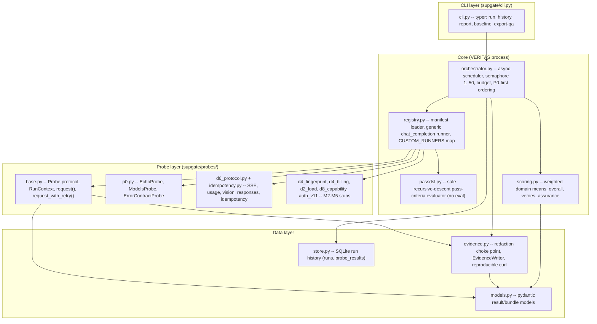
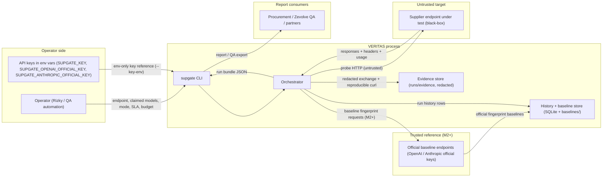

# VERITAS / supgate - System Architecture

*Status: tracks the implemented M1 (foundation + D6 protocol) and the target M2-M6
shapes. Source of truth for design intent: `supgate-build-plan.md` (Notion export,
6 Aug 2026). This document mirrors the code as of M1 and marks everything that is
"target" (not yet built). Target baseline schema: `docs/08-output-data-contract.md`
schema v2, which explicitly supersedes the build-plan scaffold for baselines.*

- Doc 02 of the VERITAS docs set. Companion: `03-evaluation-flow.md` (runtime behaviour).
- Codebase: `C:\Users\rizky\Documents\VERITAS` (package/CLI name `supgate`, v0.1.0).

---

## 1. Architecture goals

The system is a **DPS-owned, black-box admission and assurance tool** for any
OpenAI-compatible endpoint (upstream supplier, Zevolve gateway, white-label
domain). It produces a scored, evidence-backed report that supports four uses:
supplier admission, ongoing assurance, partner trust/SLA evidence, and QA issue
export for Zevolve.

Design goals, in priority order:

1. **Black-box first.** No supplier cooperation required. Everything a probe
   needs is observable over HTTP.
2. **Evidence-first, reproducible.** Every failed probe ships a redacted,
   replayable `curl`. Reports cite evidence refs, never secrets.
3. **Calibrated verdicts, never bare.** Every verdict is Pass / Warn / Fail /
   Skip with notes and evidence; never a bare status. No binary
   "distilled: yes/no" - authenticity output is a calibrated verdict with
   confidence (2 independent signal families for "suspected substitution").
4. **Neutral on relaying, punitive on tampering.** Hop count is an unscored
   lower bound. Veto only on reverse identity, substitution, billing
   inflation, hidden origin.
5. **Skipped is not failed.** Prerequisite-absent probes skip cleanly and never
   zero a domain.
6. **429 is not proof of absence.** Rate-limit-blocked probes WARN with a
   reason, never silently FAIL.
7. **Two axes, always both reported.** Quality grade (0-100 score) and Supply
   Assurance Level (A / B / C / Disqualified). An endpoint can be honest yet
   unusable, or usable yet unverified.
8. **Zero secret leakage.** Keys are env-only, redacted at a single choke
   point, and referenced (never printed) in curls and reports.
9. **Manifest-driven extension.** New probes register through YAML plus a named
   runner; calibration constants stay editable without code changes.

## 2. Current M1 vs target M2-M6 module scope

| Module | M1 (now) | M2 | M3 | M4 | M5 | M6 |
| --- | --- | --- | --- | --- | --- | --- |
| P0 foundation probes | Implemented | - | - | - | - | - |
| D6 protocol suite | Implemented (11 probes) | - | - | - | - | - |
| D4 fingerprints / billing | Stub classes, **not registered** | Implement | - | - | - | - |
| D2 load + needle recall | Stub classes, not registered | - | Implement | - | - | - |
| D8 capability suites | Stub classes, not registered | - | Implement | - | - | - |
| v1.1 authenticity (auth.*) | Stub class, not registered | - | - | - | Implement | - |
| Scoring / assurance / vetoes | Implemented (vetoes empty) | Wire real vetoes | - | - | - | - |
| Evidence + redacted curl | Implemented | - | - | - | - | - |
| Tokenizers (tiktoken/HF) | Absent (`tokenizers.py`) | Add | - | - | - | - |
| Baseline store + `baseline` cmd | Dir exists; CLI stub | Implement | - | - | - | - |
| HTML/PDF report renderer | Absent (`report/`) | - | - | Implement | - | - |
| Run history (SQLite) | Implemented (runs, probe_results) | Add baselines table | - | - | - | - |
| QA issue export | CLI stub (`export-qa`) | - | - | Implement | - | - |
| Scheduled assurance runs | Absent | - | - | - | - | Implement |
| Budget pricing table | Naive char heuristic | Replace with pricing table | - | - | - | - |
| Concurrency (D2 load matrix) | Reserved (semaphore 1..50) | - | Used at concurrency 10 | - | - | - |

M1 catalog actually runnable: **14 probes** (3 P0 + 11 D6) from
`supgate/manifests/probes.yaml` (manifest version 1).

M2 core D4 scope is 11 probes (7 fingerprint + 4 billing). The build-weekend
Must tier builds 10 of them; `d4.reasoning_cache_fields` stays in M2 scope but
is weekend Stretch.

## 3. Component graph



Note on the probe layer: the D4/D2/D8/auth `ProbeStub` classes exist in code but
are **not wired into the registry or the manifest** - `registry.py` only imports
`d6_protocol`, `idempotency`, and `p0`. In M1 their skip messages
("probe not implemented until Mx") are unreachable dead code. Wiring them in is
part of M2/M3.

## 4. Trust-boundary and data-flow graph

Actors: the **operator** (Rizky / QA automation), the **VERITAS process**
(supgate), the **supplier endpoint** (untrusted target), **official baseline
endpoints** (trusted reference, M2+), the **evidence store**, the **baseline /
history store**, and the **report consumers** (procurement, Vincent, Zevolve QA,
later white-label partners).



Boundary rules:

- **Operator -> VERITAS:** only through the CLI. Keys arrive by env-var name,
  never as argv or in files.
- **VERITAS -> supplier endpoint:** the only place real HTTP flows. Everything
  passing through `RunContext.request()` is redacted before it reaches disk.
- **VERITAS -> official baselines:** M2+. Same code paths, different (trusted)
  endpoints, used only for fingerprint recording.
- **VERITAS -> evidence/history:** append-only local stores. Evidence is
  redacted at the choke point; history stores verdicts, never secrets.
- **VERITAS -> consumers:** redacted reports / QA exports only.

## 5. Module responsibilities mapped to current files

| File | Responsibility | Status |
| --- | --- | --- |
| `supgate/cli.py` | Typer entrypoints: `run`, `history`, `report`, `baseline`, `export-qa`. Env-only key resolution, SLA parsing, exit-code mapping (0/2/3). | Implemented; `report`/`baseline`/`export-qa` are stubs |
| `supgate/orchestrator.py` | Async run loop, P0-first probe ordering, concurrency semaphore (validated 1..50), per-probe decision chain (skip / budget / mode / run), bundle assembly, `endpoint_dead()`, `summary()`, `_vetoes()` (reserved empty), `_calibration()` | Implemented (M1) |
| `supgate/models.py` | Pydantic contract: `Domain`, `Verdict`, `Assurance`, `ProbeResult`, `SurfaceMap`, `DomainScore`, `SLA`, `Veto`, `AssuranceVerdict`, `CalibrationSnapshot`, `RunBundle`, `BudgetTracker`, `TimingSample` | Implemented |
| `supgate/registry.py` | YAML manifest loader; generic `chat_completion` runner; `CUSTOM_RUNNERS` id-to-class map; placeholder fill; skip-rule evaluation; pass-DSL invocation; retry-to-Warn for generic probes | Implemented (M1) |
| `supgate/passdsl.py` | Tiny safe pass-criteria evaluator (recursive descent, no `eval`): `and`/`or`/`not`, comparisons, functions (`json_parses`, `has_keys`, `content_contains`, `finish_reason`, `choices`, `error_object`, `usage_consistent`, `no_tool_calls`) | Implemented |
| `supgate/scoring.py` | Weighted domain means (D6 30 / D4 30 / D8 25 / D2 15), overall normalized over present domains, veto layer, assurance mapping (A/B/C/Disqualified) | Implemented; veto inputs empty in M1 |
| `supgate/evidence.py` | Single redaction choke point (sk- keys, bearer tokens, auth/custom headers, URL query secrets); `EvidenceWriter` persists one redacted JSON per exchange; reproducible `curl` builder referencing `$SUPGATE_KEY` | Implemented |
| `supgate/store.py` | SQLite history at `~/.supgate/history.db`: `runs`, `probe_results`. `baselines` table reserved by plan but not yet created | Implemented (M1); baselines in M2 |
| `supgate/probes/base.py` | `Probe` protocol, `RunContext` (endpoint, key, client, surface, evidence, budget), `request()` choke point (timing, evidence, budget), `request_or_none()`, `request_with_retry()` (one 429/5xx retry -> Warn), `probe_result()`, `probe_result_with_warn()`, `RateLimitError`/`ServerError`, `warn_result()` | Implemented |
| `supgate/probes/p0.py` | `EchoProbe` (nonce echo), `ModelsProbe` (builds `SurfaceMap`), `ErrorContractProbe` (401/400 + OpenAI error object) | Implemented |
| `supgate/probes/d6_protocol.py` | `SseProbe`, `UsageFieldsProbe`, `VisionProbe`, `ResponsesApiProbe`, `parse_sse` | Implemented |
| `supgate/probes/idempotency.py` | `IdempotencyProbe`: 3x temp-0 stability, shape fingerprint, length-spread bound 0.20 | Implemented |
| `supgate/probes/d4_fingerprint.py` | D4 relay fingerprint stubs (headers diff, id prefix, model echo, self report, canary echo, SSE timing, rotation) | Stub (M2) |
| `supgate/probes/d4_billing.py` | D4 billing forensics stubs (usage presence, recount deviation, wrap offset, reasoning/cache fields) | Stub (M2) |
| `supgate/probes/d2_load.py` | D2 load matrix + needle recall stubs | Stub (M3) |
| `supgate/probes/d8_capability.py` | D8 GPT/Claude capability stubs | Stub (M3) |
| `supgate/probes/auth_v11.py` | v1.1 authenticity stubs (RNG, LLMmap, logprob, KBF, mixed routing) - domain D8 | Stub (M5) |
| `supgate/manifests/probes.yaml` | Probe registry v1: 3 P0 + 11 D6, weights, samples, cases, pass DSL, skip rules, 429 policy | Implemented |
| `baselines/` | Empty placeholder dir (plan section 11.1) | Reserved (M2) |
| `runs/` | Git-ignored run bundle + evidence output dir | Runtime output |
| `tests/` | Unit + replay tests on an in-memory ASGI `FakeOpenAI` (no live calls) | Implemented |

## 6. Probe plugin contract

The `Probe` protocol (`supgate/probes/base.py`), matching plan section 11.2:

```python
class Probe(Protocol):
    id: str            # e.g. "d6.json_mode"
    domain: Domain     # D2 | D4 | D6 | D8 | PLATFORM
    weight: float      # default 1.0 within its domain
    samples: int       # the xN counts from plan section 10

    def skip_reason(self, surface: SurfaceMap) -> str | None: ...
    async def run(self, ctx: RunContext) -> ProbeResult: ...
```

Two registration paths:

1. **Generic `chat_completion` runner** (`ManifestProbe` in `registry.py`) for
   probes whose request -> pass criteria fit a fixed shape. Everything about
   them lives in YAML: `request` (with `{model}` / `{i}` / `{nonce}`
   placeholders), `pass` DSL expression, `samples`, optional named `cases`
   (case-level request + pass), `skip_if`, `on_429`, `timeout_s`, `weight`.
   No code changes needed.
2. **Named custom runners** for bespoke logic. Implement a class with the
   protocol above, then register it in `CUSTOM_RUNNERS` keyed by probe id
   (`registry.py`). The manifest entry still owns `domain`, `weight`,
   `samples`, and (for generic entries) tolerances so calibration constants
   stay editable. Current custom runners: `p0.echo`, `p0.models`,
   `p0.error_contract`, `d6.chat.sse`, `d6.usage_fields`, `d6.vision`,
   `d6.responses_api`, `d6.idempotency`.

`RunContext` is the probe's world: endpoint config, api key, primary `model`
(first claimed model), `claimed_models`, the shared `SurfaceMap`, a shared
`httpx.AsyncClient`, the `EvidenceWriter`, and the `BudgetTracker`. All HTTP
must go through `ctx.request()` so redaction, evidence capture, timing, and
budget accounting happen at one choke point.

M2 target: `RunContext` gains `stream()` (one `StreamedEvent` per SSE data
payload with arrival timestamps, retried with `request_with_retry` semantics)
for `d4.sse_timing` and D2 load timing. See `06-m2-probe-spec.md` section 3.3;
evidence is captured once at stream end. This is sequenced before the M2 probe
blocks over the build weekend.

`ProbeResult` carries `verdict`, `score` (0-100), `weight`, `successes` /
`attempts`, `notes`, `evidence_ref`, `curl`, optional timing `samples`, and an
`error`. Verdicts are never bare (plan section 10).

## 7. Concurrency and timing design

- **Semaphore:** a single `asyncio.Semaphore(self.concurrency)` guarded to
  1..50 (plan section 5). Default 10.
- **M1 reality:** the orchestrator loop awaits each probe inline
  (`for probe in probes: async with semaphore: ...`), so probes execute
  **sequentially**. The semaphore is validated and reserved; real concurrent
  fan-out arrives with D2 in M3, where each band issues 20 streamed requests at
  concurrency 10.
- **Timing discipline (plan section 5):** timing starts **after** the semaphore is
  acquired, so local load-host queueing never pollutes latency percentiles.
  `RunContext.request()` records per-request wall-clock `_supgate_ms`; D2 will
  derive TTFT/TPOT/ITL/E2E percentiles from it. TPOT/ITL exclude the first
  token (vLLM bench-serve convention). `TimingSample` is reserved now.
- **Timeouts:** global default 60 s per request (`Orchestrator.timeout_s`),
  overridable per probe via `timeout_s` in the manifest.
- **Retry backoff:** one retry with 0.5 s sleep on 429/5xx (see
  `03-evaluation-flow.md` section "Retry policy").

## 8. Security and redaction boundaries

- **Keys are env-only.** The CLI accepts `--key-env NAME` and reads the key from
  the environment. Keys never appear in argv, logs, evidence, or reports.
- **Single choke point.** `RunContext.request()` is the only path that touches
  the wire; `evidence.py` is the only path that writes it. Redaction rules:
  - `sk-...` keys become stubs (`sk-abc****WXYZ` style); short keys keep a
    non-reconstructable prefix.
  - Bearer tokens become `abcd****mnop`.
  - `Authorization` header becomes `Bearer $SUPGATE_KEY`; custom auth headers
    (`x-api-key`, `api-key`, `access_token`, `token`, `auth*`, ...) become
    `$SUPGATE_KEY`.
  - Sensitive URL query params (`api_key`, `key`, `token`, `secret`, ...) are
    replaced by `$SUPGATE_KEY`.
  - Redaction is recursive over JSON payloads.
- **Reproducible curls** reference `$SUPGATE_KEY` instead of printing the key,
  so failures replay without exposing secrets.
- **Self-check intent (plan section 10.1):** the error-contract probe doubles as a
  harness self-check. Today it verifies 401/400 + OpenAI-style error object;
  the "no supgate fingerprint leaks into requests" check is only partially
  covered (request headers are limited to Authorization + Content-Type; httpx's
  default user agent is not stripped or asserted).
- **Report/evidence path:** evidence stores redacted req/resp only; reports
  reference evidence keys and never print them.

## 9. Baseline registry design

- **Purpose:** fingerprints captured from **official** endpoints (OpenAI,
  Anthropic) become the reference for D4 and v1.1 authenticity probes
  (`d4.headers_diff` diff source, `auth.rng_fingerprint` distribution,
  `auth.llmmap` reference bank, `auth.kbf_battery` cutoff baselines,
  calibration constants).
- **Layout:** `baselines/<baseline_id>.json` at repo root (empty now) per
  `docs/08-output-data-contract.md` section 10, plus a planned `baselines`
  table in SQLite (docs/08 section 11). The target baseline schema is the
  `docs/08` schema v2 and **explicitly supersedes the build-plan scaffold**.
  The table is **not yet created** by `store.py` (M2).
- **CLI:** `supgate baseline` is a stub (M2). Target form:
  `supgate baseline record --vendor openai --model gpt-4o --key-env SUPGATE_OPENAI_OFFICIAL_KEY`.
- **Key env (canonical):** official baselines use
  `SUPGATE_OPENAI_OFFICIAL_KEY`, `SUPGATE_ANTHROPIC_OFFICIAL_KEY`, and
  `SUPGATE_OFFICIAL_BASE_URL` (overrides the vendor's well-known base URL).
  Baseline recording shares the same env-only + redaction rules as live runs.
- **Capture kinds:** headers/response-id fingerprints, model alias maps, RNG
  distributions, knowledge-boundary profiles, logprob drift baselines,
  calibration constants per tokenizer family (recount tolerance, wrap-offset
  alarm threshold, idempotency variance bound, goodput pass bar).
- **Consumption:** probes read baselines through the `RunContext`/store;
  assurance confidence references the calibration snapshot embedded in each
  bundle (`CalibrationSnapshot`). Re-baselining per model version mitigates
  false accusations when providers update or quantize.
- **Key safety:** baseline recording also requires env-only keys and shares the
  same evidence redaction.

## 10. Deployment and topology options

1. **Local CLI (current).** `supgate run ...` on the operator machine. Output
   bundle + evidence under `--out` (default `runs/`); history in
   `~/.supgate/history.db`. This is the M1 reality and the M4 report path.
2. **Scheduled assurance runner (M6).** Cron-like trigger running `full`-mode
   report-only runs against production endpoints. Open decision (section 14): merge
   into the existing Daily Model Health Monitor or run as a separate trigger.
3. **Report rendering (M4).** JSON bundle -> Jinja2 HTML -> headless Chromium
   PDF (per PDF Export Style Guide). Storage home is an open decision (vault
   Reference vs QA Reports attachments).
4. **Partner service (later).** White-label partners consume reports as a
   service; partner-facing versions go through commercial review and must not
   leak internal findings.

Python 3.12 is planned; `pyproject.toml` currently declares `requires-python
>= 3.11`. Dependencies: httpx, pydantic, pyyaml, typer (dev: pytest,
pytest-asyncio, ruff). tiktoken/HF tokenizers (M2) and Jinja2 (M4) are planned,
not yet declared.

## 11. Failure isolation

- **Per-probe isolation.** One probe's failure never aborts the run. Every
  probe returns a `ProbeResult`; a transport error in one probe is recorded as
  evidence (`status: 0`) and the loop continues.
- **Run-level gates.** A run "fails" only at the CLI exit-code level: exit 2
  when `p0.echo` FAILs (P0 dead / endpoint unreachable, including auth
  failure), exit 3 on config/run aborts. All other outcomes still produce a
  bundle and exit 0 - verdicts live in the report, not the exit code.
- **Retry-to-Warn.** Persistent 429/5xx (after one retry) becomes an explicit
  WARN, never a silent FAIL; transport errors stay FAIL so dead endpoints still
  surface. (See `03-evaluation-flow.md`.)
- **Budget isolation.** Budget exhaustion never silently skips: remaining
  probes become explicit "budget-blocked" WARNs.
- **Veto independence.** Veto signals (reverse identity, substitution, billing
  inflation, hidden origin) are computed independently of the score and force
  Disqualified regardless of the number.
- **Partial output.** The bundle is written even when probes fail; history
  records dead-endpoint runs before the CLI exits 2.

## 12. ADR-style key decisions

| ID | Decision | Rationale / consequence |
| --- | --- | --- |
| ADR-001 | Python 3.12 (declared >=3.11), httpx async, pydantic, typer; NOT Go | Reference tool is Go; Python builds faster for us and is fine at concurrency <= 50. Consequence: reuse `passdsl.py` instead of Go's typed probe registry. |
| ADR-002 | Keys env-only + single evidence redaction choke point | Secrets never reach argv/logs/evidence/curl. Consequence: `RunContext.request()` and `evidence.py` are the only places secrets and wire bytes cross. |
| ADR-003 | One backoff retry on 429/5xx, then explicit WARN; transport errors stay FAIL | 429 is not proof of absence; but a dead endpoint must still surface as exit 2. Consequence: `endpoint_dead` keys off `p0.echo == FAIL`, and persistent 429/5xx must not set it. |
| ADR-004 | Skipped is not failed; overall normalizes over domains that actually ran | Skips can't zero a domain; M1 D6-only runs score correctly. Consequence: score is relative to verified surface, so C is the honest floor until D4/D8 run. |
| ADR-005 | Verdicts live in the report, not the exit code | A run with failing probes still exits 0. Consequence: exit codes are operational (0/2/3) only. |
| ADR-006 | Manifest-driven probes with named custom runners | New probes register via YAML + optional runner class; calibration constants stay editable. Consequence: `CUSTOM_RUNNERS` maps ids, and manifest `runner` values only disambiguate errors. |
| ADR-007 | Relaying is neutral; tampering is penalized; veto layer independent of score | Hop count unscored; only reverse identity / substitution / billing inflation / hidden origin disqualify. Consequence: vetoes are a separate list in the bundle, empty in M1. |
| ADR-008 | Black-box caps at Assurance B; A requires supplier credentials | Two axes always reported. Consequence: `assurance()` in `scoring.py` returns C without D4/D8 evidence, B only when D4>=80 and D8>=80 and overall>=70. |
| ADR-009 | P0 runs first to build SurfaceMap, but M1 runs all probes sequentially and does not short-circuit on P0 failure | Separates "endpoint dead" from "probe failed"; keeps run history complete. Consequence: exit 2 is decided after the bundle is produced; a future optimization could short-circuit. |
| ADR-010 | Evidence-first: every exchange persisted redacted + reproducible curl | QA issues and commercial evidence need replayable proof. Consequence: disk usage grows with samples; acceptable at this scale. |

## 13. Known inconsistencies and open decisions

See the build-plan section 14 open decisions (baseline account ownership, storage home,
per-tier SLA defaults, M6 trigger home). Additional observations from the M1
code:

1. **Stub probes are dead code.** `d4_fingerprint`, `d4_billing`, `d2_load`,
   `d8_capability`, `auth_v11` define `ProbeStub` classes that `registry.py`
   never imports and the manifest never references. Their
   "not implemented until Mx" skip behaviour is unreachable; M2/M3 must both
   register runners and add manifest entries.
2. **Manifest path moved.** Plan section 11.1 puts `manifests/probes.yaml` at repo
   root (the root `manifests/` dir exists, empty); the real manifest is inside
   the package (`supgate/manifests/probes.yaml`). Hatchling's default wheel
   include is `*.py`/`*.pyi`/`py.typed` - the YAML may not be packaged. Verify
   with a wheel build before relying on a pip-installed CLI; if it is missing,
   add a package-data or force-include entry.
3. **Retry policy divergence on mixed failures.** When a probe sees both a
   retryable failure (429/5xx) and a genuine failure with zero successes, the
   custom runners (`probe_result_with_warn`) WARN while the generic runner
   (`ManifestProbe`) FAILs. Edge case, but the two paths should agree.
4. **`baselines` table not created.** `store.py` creates `runs` and
   `probe_results` only; the `baselines` table (docs/08 section 11, schema v2)
   lands in M2.
5. **Exit 2 conflates unreachable with auth failure.** `endpoint_dead` is true
   whenever `p0.echo` FAILs, including a 401 wrong key, not just transport
   failure. Documented behaviour, but the exit-code name is misleading; a
   separate auth-diagnosis task is planned so a bad key is reported as an auth
   problem, not "endpoint unreachable".
6. **Invalid `--concurrency` exits 1, not 3.** `Orchestrator(...)` is built
   outside the CLI try/except, so a value outside 1..50 raises an uncaught
   ValueError (typer exits 1) instead of the documented abort path (3). Known
   deviation; a weekend fix moves the validation inside the CLI try/except.
7. **P0 intra-group order is alphabetical.** Sorting puts `p0.error_contract`
   before `p0.models`; the SurfaceMap is therefore complete only after the
   last P0 probe. Fine for M1 (no D6 probe consumes it yet), but
   manifest-order dependence must be documented for M2.
8. **`auth_v11` assigns domain D8.** Authenticity probes are identity signals
   and arguably belong to D4; D8 (capabilities) is the current stub default.
   Needs a decision before M5.
9. **Budget accounting precedes the run decision.** Budget is checked before
   each probe, but cost is only counted as requests complete - a probe may run
   past the cap once. Matches "blocks further probes when hit".
10. **Fingerprint self-check is partial.** `p0.error_contract` checks error
    shape but not user-agent/fingerprint leakage into requests (plan section 10.1).
