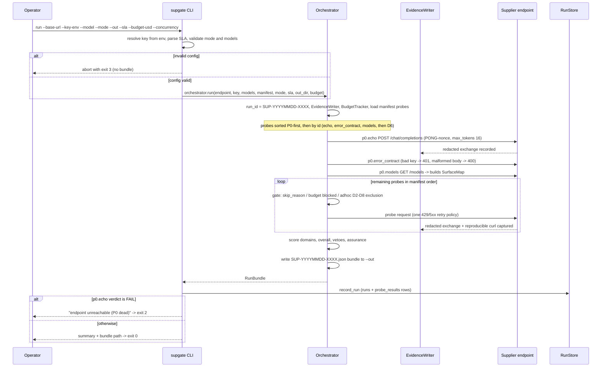
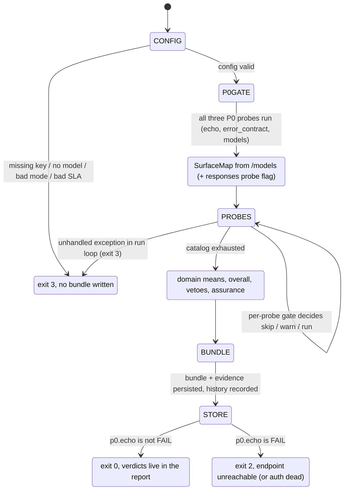
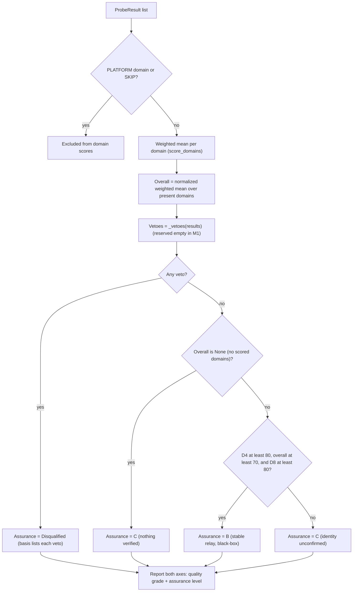
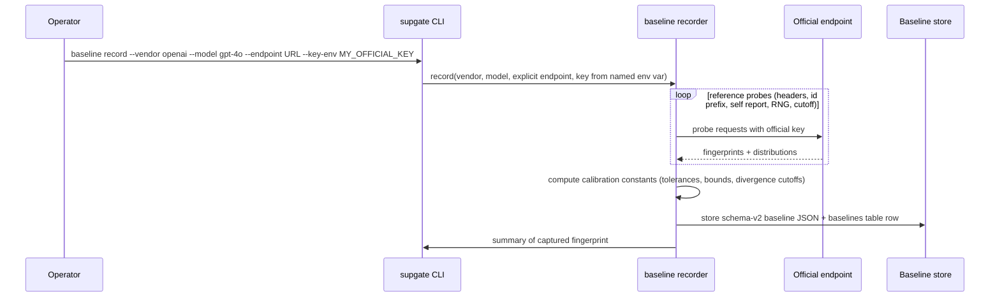

# VERITAS / supgate - Evaluation Flow

*Status: mirrors the implemented M1 behaviour exactly and marks target (M2/M6)
flows. Companion to `02-system-architecture.md`. Source of truth for behaviour:
`supgate-build-plan.md` and the M1 tests in `tests/`.*

Conventions used here: `current` = implemented in M1; `target` = designed for
M2/M3/M6 and not yet in the codebase. Pseudocode is Python-flavoured and precise
enough to implement from. Exit codes: `0` report produced, `2` endpoint
unreachable (P0 dead), `3` aborted.

---

## 1. Run lifecycle overview

A run is: **configure -> P0 gate (order: echo, error_contract, models) ->
SurfaceMap -> probe catalog (skip / budget / adhoc gates, then run) -> score ->
vetoes -> assurance -> bundle write -> history record -> exit code.**

Global rules that apply at every probe:

- Retry policy: see section 8 (one backoff retry on 429/5xx, then explicit
  WARN; a transport error stays FAIL).
- Every request passes through `RunContext.request()`: timing, evidence
  capture, and budget accounting happen there.
- Verdicts are Pass / Warn / Fail / Skip with notes and evidence refs - never
  bare.
- Skipped probes never lower a domain; budget-blocked probes WARN, never
  silently skip.

## 2. End-to-end run sequence



## 3. Run state machine



Notes:

- There is **no early abort** on P0 failure in M1. A failing `p0.echo` still
  lets the rest of the catalog run so the bundle is complete; the gate is
  enforced at exit-code time (`endpoint_dead`).
- Budget exhaustion does not change the run state; it converts each remaining
  probe to a "budget-blocked" WARN.

## 4. P0 gate

P0 = `p0.echo`, `p0.error_contract`, `p0.models` (in that sorted order, see
`02-system-architecture.md` section 13). Responsibilities:

- `p0.echo` - minimal chat echoing `PONG-` + nonce. Separates "endpoint dead"
  from "probe failed" for everything downstream. FAIL on non-200 or nonce
  missing; WARN on persistent 429/5xx; FAIL on transport error.
- `p0.error_contract` - bad key must return 401 with an OpenAI-style error
  object; malformed body must return 400 with the same shape. Harness
  self-check intent (fingerprint leak check is only partial today).
- `p0.models` - GET `/models`; records the catalog and whether a claimed model
  (or alias) is listed. This **builds the `SurfaceMap`** that every `skip_if`
  rule consumes.

Current semantics of the "P0 gate":

```python
# orchestrator sorts so P0 runs first, then the rest:
probes = sorted(probes, key=lambda p: (p.id not in P0_IDS, p.id))
# P0_IDS = {"p0.echo", "p0.models", "p0.error_contract"}
# actual execution order: p0.echo, p0.error_contract, p0.models, then D6 by id

# gate enforced after the whole run:
def endpoint_dead(bundle) -> bool:
    echo = find(bundle.probes, "p0.echo")
    return echo is not None and echo.verdict == FAIL

# CLI: if endpoint_dead(bundle): print "endpoint unreachable (P0 dead)"; exit 2
```

Design note (target): a future optimization may short-circuit the catalog when
`p0.echo` FAILs. M1 deliberately does not, so history and evidence stay complete.

## 5. SurfaceMap discovery

`SurfaceMap` is a mutable object shared through `RunContext` and populated
during P0 and surface probes:

- `p0.models` sets `models` (catalog ids) and `claimed_present`.
- `d6.responses_api` sets `responses_api` to True on a 200 response or False on
  a clean unsupported error (400/404/405/501).
- `messages_api` and `logprobs` are reserved for M3 (`d8.claude_suite`) and M5
  (`auth.logprob_audit`); nothing sets them in M1.

The manifest declares `skip_if` conditions that `ManifestProbe.skip_reason()`
evaluates against the map:

| Condition | Skip when |
| --- | --- |
| `no_claimed_model` | `surface.claimed_present` is False |
| `no_responses_api` | `surface.responses_api` is False |
| `no_messages_api` | `surface.messages_api` is False |

M1 manifest has no probe using `skip_if`; the machinery is in place for M2/M3.
A snapshot of the map is embedded in each bundle as `CalibrationSnapshot`.

## 6. Prerequisite skips

Decision order inside `Orchestrator._run_probe` (verified by
`test_skip_reason_beats_budget_blocked`):

```python
async def _run_probe(probe, ctx, mode, budget):
    # 1. surface prerequisite
    if reason := probe.skip_reason(ctx.surface):
        return SKIP(probe, notes=[f"skipped: {reason}"])
    # 2. budget (after skip, so skips are never "budget-blocked")
    if budget.blocked:
        return WARN(probe, score=0, notes=["budget-blocked: per-run cost cap exhausted"])
    # 3. mode exclusion
    if mode == "adhoc" and probe.domain in {D2, D8}:
        return SKIP(probe, notes=["skipped: adhoc mode excludes load/capability probes"])
    # 4. run
    result = await probe.run(ctx)
    result.evidence_ref = ctx.evidence.refs_for(probe.id)
    result.curl = ctx.evidence.curl_for(probe.id)
    return result
```

Skips are excluded from scoring (`score_domains` drops `PLATFORM` and `SKIP`
results), so a fully skipped domain simply does not contribute to the overall -
it can never zero a scored domain.

## 7. Budget behaviour

- `BudgetTracker` accumulates `requests`, `prompt_chars`, `completion_chars`,
  and an `estimated_usd` using a naive `chars/4 ~= tokens` heuristic at a
  blended `$0.005 / 1K` rate (M1 placeholder; real tokenizer/pricing table in
  M2).
- `RunContext.request()` calls `budget.add(...)` after every response (and on
  transport error, before re-raising).
- `budget.blocked` flips once `estimated_usd >= budget_usd`. It is checked
  **before** each probe; once set, every later probe becomes an explicit
  "budget-blocked" WARN (score 0) - never a silent skip, never a Fail.
- Budget is checked after the skip gate, so genuinely skipped probes are
  reported as skips, not as budget-blocked.
- A probe already in flight when the cap trips is allowed to complete
  ("blocks further probes when hit", plan section 12).
- Suggested operator inputs (plan section 12): adhoc 5 USD, full 25 USD. These
  are operator inputs, **not** CLI defaults; the CLI default is unlimited
  (`--budget-usd` optional).

## 8. Retry policy

Global rule (plan section 10): **one backoff retry on 429/5xx, then an explicit WARN;
a transport error stays FAIL.**

Shared helper used by all custom P0/D6 probes:

```python
async def request_with_retry(ctx, probe_id, method, path, *, backoff_s=0.5, **kwargs):
    for attempt in (0, 1):
        response = await ctx.request(probe_id, method, path, **kwargs)
        # ctx.request records evidence and re-raises transport errors
        if response.status_code == 429 or response.status_code >= 500:
            if attempt == 0:
                await asyncio.sleep(backoff_s)
                continue
            if response.status_code == 429:
                raise RateLimitError(response.status_code,
                                     "429 after retry -> WARN per plan section 10")
            raise ServerError(response.status_code,
                              "5xx after retry -> WARN per plan section 10")
        return response   # success, or a status the probe must inspect (401/400/...)
```

Callers translate:

- `RateLimitError` / `ServerError` -> `probe_result_with_warn(..., warn_failures=True)`
  -> **WARN** (score 50), with a note ("rerun with backoff or higher-quota key").
- Any other exception (transport) -> `probe_result_with_warn(..., transport_failures=True)`
  -> **FAIL** (score 0) so dead endpoints still surface as exit 2.
- A returned 401/400/clean error is inspected by the probe itself (pass/fail per
  its own criteria).

The generic `ManifestProbe._sample` implements the same policy inline:

```python
async def _sample(ctx, payload, i, pass_expr):
    for attempt in (0, 1):
        try:
            response = await ctx.request(self.id, "POST", "/chat/completions", payload=payload, timeout_s=...)
        except Exception as exc:
            return ("fail", [f"sample {i}: transport error: {exc}"])   # FAIL stays FAIL
        if response.status_code == 429:
            if attempt == 0:
                await sleep(0.5); continue
            return ("rate_limited", [f"sample {i}: 429 after retry"])
        if response.status_code >= 500:
            if attempt == 0:
                await sleep(0.5); continue
            return ("server_error", [f"sample {i}: 5xx after retry -- Warn per plan section 10"])
        if not eval_pass(pass_expr, env_for(response, payload)):
            return ("fail", [f"sample {i}: pass criteria not met"])
        return ("pass", [])
```

Verdict from counts (both paths, schematic):

```python
def verdict_from_counts(successes, attempts, retryable_failures, transport_failures):
    if attempts == 0:
        return FAIL, 0.0
    if successes == attempts:
        return PASS, 100.0
    if successes > 0:
        return WARN, round(successes / attempts * 100, 1)     # partial
    # successes == 0:
    if retryable_failures == attempts and not transport_failures:
        return WARN, 50.0       # all failures were persistent 429/5xx
    return FAIL, 0.0
```

Behavioural nuances (current code):

- Generic runner: WARN iff **every** sample ended in 429/5xx (no transport, no
  pass-criteria failure). `d6.idempotency` returns WARN score 0 when it has no
  usable samples, and WARN 50 when degraded by infra while structurally stable.
- Edge divergence: a mix of "retryable failure + genuine failure with zero
  successes" WARNs on the custom runners but FAILs on the generic runner (see
  architecture doc section 13).
- `p0.echo` WARN on persistent 429/5xx must **not** set `endpoint_dead`
  (verified by `test_echo_429_does_not_trigger_endpoint_dead`).

## 9. Probe lifecycle

Per probe, in order:

1. **Load.** Registry instantiates a generic `ManifestProbe` (from YAML) or a
   custom runner (from `CUSTOM_RUNNERS`).
2. **Skip gate** - `skip_reason(surface)`; may depend on the SurfaceMap built
   by earlier probes.
3. **Budget gate** - WARN "budget-blocked" if the cap tripped.
4. **Mode gate** - adhoc excludes D2/D8.
5. **Run** - `async run(ctx)` executes its `samples` (possibly as named
   `cases`), each going through `ctx.request()` with the retry policy.
6. **Collapse** - sample outcomes -> one `ProbeResult` verdict/score/successes/
   attempts/notes (see section 8).
7. **Attach evidence** - orchestrator sets `evidence_ref` (all refs) and `curl`
   (last redacted curl) onto the result.
8. **Collect** - results accumulate for scoring.

`d6.idempotency` has its own lifecycle: 3 sequential temp-0 samples; PASS needs
200 + non-empty content + stable shape fingerprint + stable `finish_reason` +
char-length spread <= 0.20; spread over bound -> WARN with lengths evidence;
any structural mismatch / empty / non-200 -> FAIL; all-infra -> WARN.

## 10. Evidence and curl capture

`RunContext.request()` is the single choke point (pseudocode):

```python
async def request(ctx, probe_id, method, path, *, payload=None, raw_body=None, headers=None, timeout_s=60):
    url = ctx.endpoint + path
    started = perf_counter()
    try:
        response = await ctx.client.request(method, url,
                                            headers=ctx.headers(headers),
                                            timeout=timeout_s,
                                            json=payload if raw_body is None else None,
                                            content=raw_body if raw_body is not None else None)
        duration_ms = (perf_counter() - started) * 1000
    except Exception as exc:                       # transport error
        curl = build_curl(method, url, ctx.headers(headers), payload)
        ctx.evidence.save(probe_id, status=0, response_body=f"transport error: {type(exc).__name__}: {exc}",
                          curl=curl, ...)          # evidence for the failed attempt is still recorded
        raise                                       # caller marks the probe fail
    body = decode(response, payload)                # JSON, or text for streams
    ctx.budget.add(json.dumps(payload or {}), text_of(body))
    curl = build_curl(method, url, response.request.headers, payload)
    ctx.evidence.save(probe_id, status=response.status_code,
                      request=..., response=..., curl=curl)
    response._supgate_ms = duration_ms
    return response
```

`EvidenceWriter.save(...)` writes `<out>/evidence/<run_id>/<probe_id>_NNN.json`
containing the redacted request (method, url, headers, body, curl), the redacted
response (status, headers, body), and a capture timestamp. It also records the
ref and the last curl per probe. Redaction rules are in
`02-system-architecture.md` section 8. Curls reference `$SUPGATE_KEY` and are
replayable without printing the secret.

## 11. Scoring, veto, and assurance flow



- Domain weights: D6 0.30, D4 0.30, D8 0.25, D2 0.15. PLATFORM unscored.
- Domain score = sum(probe.score * probe.weight) / sum(weights) over scored,
  non-skipped probes in the domain; rounded to 1 decimal.
- Overall = same weighted formula normalized over the domains that actually
  scored (a D6-only M1 run yields overall == D6 score).
- Assurance mapping: veto -> Disqualified (regardless of score); overall None
  -> C; D4>=80 and overall>=70 and D8>=80 -> B; else C. A requires supplier
  credentials (white-box, target M2+). Black-box caps at B.
- M1 veto inputs are empty; the shape is reserved and the disqualifying signals
  (reverse identity, substitution, billing inflation, hidden origin) wire in M2.

## 12. Baseline recording flow (shipped M2)



Current state: `supgate baseline record/list/show/select` and the schema-v2
baseline file store are implemented. `--endpoint` and `--key-env` are required
for every recording; no shared endpoint/key defaults are consulted. Baseline
account ownership and the live cost line remain operator decisions.

## 13. Scheduled assurance flow (target M6)

1. Trigger: cron-like schedule, or merged into the Daily Model Health Monitor
   (open decision, plan section 14).
2. For each monitored production endpoint: run `full` mode (report-only) with a
   budget cap and the per-tier SLA (or global default).
3. Store the bundle and history row as normal.
4. Compare against previous runs and stored baselines:
   - new or changed veto signals -> Disqualified alert;
   - D4/D2/D8 regression vs prior run -> alert;
   - goodput below pass bar -> alert.
5. Export failed probes as numbered QA issues (`supgate export-qa`) for Zevolve.

## 14. Live endpoint acceptance flow (target M2)

The procedure used to accept a candidate supplier endpoint into Model Square:

1. Obtain an evaluation key from the supplier (env-only: `--key-env`).
2. Run `adhoc` first (P0 + D6 core + D4 quick fingerprints) - minutes, minimal
   tokens. If P0 is dead (exit 2) or D6 core fails, stop; the endpoint is
   unusable regardless of later evidence.
3. Run `full` (entire catalog incl. D2 bands and D8 suites) with a budget cap.
4. Verify fingerprints against official baselines:
   - run the same probes against the official OpenAI/Anthropic endpoint as a
     **clean control** (expected: no veto, expected headers/ids);
   - run against one known relay as a **positive control** (expected: relay
     detected, e.g. official headers stripped, foreign id prefix).
5. If a 429-blocked probe Warns, rerun it with a higher-quota key or increased
   backoff before accepting a Fail verdict.
6. Produce the report bundle; the admission decision reads both axes (quality
   grade + assurance level) plus the veto list. Partner-facing versions go
   through commercial review.

This is the M1-verified gap: "live DPS endpoint acceptance remains pending an
evaluation key" (see project log 6 Aug 2026).

## 15. Implementable pseudocode

Snippets marked `(current)` are faithful to the M1 code but abbreviated for
readability; `(target)` snippets are design sketches. None is a drop-in module;
any snippet that is schematic rather than runnable Python is marked as such.

### 15.1 Orchestrator main loop (current, abbreviated)

```python
async def run(self, *, endpoint, api_key, claimed_models, manifest_path, mode,
              sla, out_dir, budget_usd):
    if mode not in {"adhoc", "full"}:
        raise ValueError(f"invalid mode {mode!r} (expected adhoc or full)")
    run_id = f"SUP-{now_utc():%Y%m%d}-{secrets.token_hex(2).upper()}"
    evidence = EvidenceWriter(out_dir / "evidence", run_id)
    budget = BudgetTracker(budget_usd=budget_usd if budget_usd is not None else self.budget_usd)
    probes = load_probes(manifest_path)
    probes = sorted(probes, key=lambda p: (p.id not in P0_IDS, p.id))  # P0 first

    semaphore = asyncio.Semaphore(self.concurrency)   # 1..50, validated in __init__
    client = httpx.AsyncClient(transport=self.transport, timeout=self.timeout_s)
    surface = SurfaceMap()
    model = claimed_models[0] if claimed_models else "gpt-4o"
    ctx = RunContext(endpoint=endpoint, api_key=api_key, model=model,
                     claimed_models=claimed_models, surface=surface,
                     client=client, evidence=evidence, budget=budget)
    results = []
    try:
        for probe in probes:
            async with semaphore:
                results.append(await self._run_probe(probe, ctx, mode, budget))
    finally:
        await client.aclose()

    domain_scores = score_domains(results)
    overall = overall_score(domain_scores)
    vetoes = _vetoes(results)                 # empty in M1
    verdict = assurance(overall, domain_scores, vetoes, mode=mode)
    bundle = RunBundle(
        run_id=run_id, endpoint=endpoint, claimed_models=claimed_models,
        mode=mode, started_at=started, finished_at=now(),
        versions={"supgate": __version__, "manifest": manifest_version,
                  "baselines": "none (M2)"},
        sla=sla or SLA(), overall_score=overall, domain_scores=domain_scores,
        assurance=verdict, vetoes=vetoes,
        calibration=_calibration(results, surface), probes=results,
        transit={"hop_lower_bound": 1, "origin_class": "unknown"},
    )
    (out_dir / f"{run_id}.json").write_text(bundle.model_dump_json(indent=2))
    return bundle
```

### 15.2 Per-probe gate (current) - see section 6.

### 15.3 Retry policy (current) - see section 8.

### 15.4 Evidence capture (current) - see section 10.

### 15.5 Generic manifest sample + verdict collapse (current)

```python
async def run(self, ctx):
    successes = rate_limited = server_errors = 0
    notes = []
    cases = self.cases or [{"request": self.request, "pass": self.pass_expr,
                            "samples": self.samples}]
    for case in cases:
        for i in range(int(case.get("samples", 1))):
            payload = fill_placeholders(ctx.model, i, case.get("request", self.request))
            outcome, sample_notes = await self._sample(ctx, payload, i, case.get("pass", self.pass_expr))
            notes.extend(sample_notes)
            if outcome == "pass": successes += 1
            elif outcome == "rate_limited": rate_limited += 1
            elif outcome == "server_error": server_errors += 1

    attempts = self.samples
    if attempts > 0 and successes == 0 and rate_limited + server_errors == attempts:
        # all failures were persistent 429/5xx -> explicit WARN (plan section 10)
        return ProbeResult(verdict=WARN, score=50.0, notes=notes + [retry_summary(...)])
    return probe_result(self.id, self.domain, successes=successes, attempts=attempts,
                        notes=notes, weight=self.weight)
    # probe_result: PASS if successes==attempts; WARN if 0 < successes < attempts
    # (score = successes/attempts*100); FAIL if successes==0.
```

### 15.6 Scoring and assurance (current)

```python
DOMAIN_WEIGHTS = {D6: 0.30, D4: 0.30, D8: 0.25, D2: 0.15}

def score_domains(results):
    buckets = {}
    for r in results:
        if r.domain == PLATFORM or r.verdict == SKIP:
            continue                    # skips never lower a domain
        buckets.setdefault(r.domain, []).append(r)
    out = {}
    for domain, probes in buckets.items():
        total_w = sum(p.weight for p in probes) or 1.0
        score = sum(p.score * p.weight for p in probes) / total_w
        out[domain] = DomainScore(domain, round(score, 1),
                                  probes=[p.probe_id for p in probes],
                                  verdict_counts=count_by_verdict(probes))
    return out

def overall_score(domain_scores):
    present = [d for d, s in domain_scores.items()
               if Domain(d) in SCORED_DOMAINS and s.probes]
    if not present:
        return None
    weights = {d: DOMAIN_WEIGHTS[Domain(d)] for d in present}
    total = sum(weights.values()) or 1.0
    return round(sum(domain_scores[d].score * weights[d] for d in present) / total, 1)

def assurance(overall, domain_scores, vetoes, *, mode):
    if vetoes:
        return DISQUALIFIED(basis=[f"veto {v.code}: {v.detail}" for v in vetoes], vetoes=vetoes)
    if overall is None:
        return C(basis=["no scored domains - nothing verified yet"])
    d4 = domain_scores.get("D4"); d8 = domain_scores.get("D8")
    if d4 and d4.score >= 80 and overall >= 70 and d8 and d8.score >= 80:
        return B(basis=["stable relay (no reverse/mixing detected), capabilities verified, black-box"])
    return C(basis=[...])   # identity evidence: D4 score or "no D4 evidence - M2"
```

### 15.7 Baseline record (target M2)

```python
async def record(vendor, model, key_env):
    key = read_env(key_env)                 # env-only
    fingerprints = {}
    for probe in BASELINE_PROBES:           # headers, id_prefix, self_report, rng, cutoff
        fingerprints[probe.id] = await probe.run_against(official_base_url(vendor), key)
    constants = calibrate(fingerprints)     # tolerances, bounds, divergence cutoffs
    record = BaselineRecord(
        schema=2,
        baseline_id=next_baseline_id(vendor, model),
        provider_label=vendor,
        claimed_models=[model],
        captured_at=now(),
        fingerprints=fingerprints,
        calibration=constants,
        bundle_path=None,
    )
    write_json(f"baselines/{record.baseline_id}.json", record)
    insert_baseline_row(record)             # docs/08 section 11 columns
```

### 15.8 Scheduled assurance (target M6)

```python
def scheduled_assurance(endpoints, schedule, sla_by_tier):
    for endpoint in endpoints:
        bundle = run_full(endpoint, budget=25, sla=sla_by_tier[endpoint.tier])  # 25 = operator input, not a CLI default
        prev = latest_baseline_or_run(endpoint)
        alerts = diff(bundle, prev)         # vetoes, domain regressions, goodput
        notify(alerts)
        for failed in failed_probes(bundle):
            export_qa_issue(failed)         # numbered-list Zevolve format
```

## 16. Exception and abort paths, exit codes

| Path | Where | Behaviour | Exit code |
| --- | --- | --- | --- |
| Missing key env var | `cli._resolve_key` | `_abort` with message | 3 |
| No `--model` | `cli.run` | `_abort` "at least one --model is required" | 3 |
| Invalid `--mode` | `cli.run` / `orchestrator.run` | `_abort` / ValueError | 3 |
| Invalid SLA (unknown key, missing value, non-numeric, negative) | `cli._parse_sla` | `_abort` with the specific offending item | 3 |
| `--concurrency` outside 1..50 | `Orchestrator.__init__` (outside cli try) | Uncaught ValueError -> typer exits 1 (known deviation, see arch doc 13.6; weekend fix moves validation inside the CLI try/except) | 1 |
| Unexpected exception in run loop | `cli.run` except | `_abort("run aborted: ...")`; bundle not written | 3 |
| `p0.echo` FAIL (transport, 401, nonce mismatch) | `endpoint_dead` after bundle | Message + exit; bundle and history are still written. A 401 wrong key currently also FAILs `p0.echo` -> exit 2; a separate auth-diagnosis task is planned (arch doc 13.5) | 2 |
| `p0.echo` WARN (persistent 429/5xx) | `endpoint_dead` | Not dead; run completes normally | 0 |
| Any other probe FAIL | none | Verdict lives in the report; run exits | 0 |
| Budget cap hit mid-run | `_run_probe` | Remaining probes -> "budget-blocked" WARN | 0 |
| Unhandled exception inside `ctx.request` (transport) | per probe | Evidence saved with status 0; probe FAILs; run continues | 0 |

Rules of thumb:

- **Exit codes are operational, not verdicts.** Verdicts (including a run where
  every D6 probe failed) live in the bundle JSON, and the run still exits 0.
- **Dead endpoint detection keys only off `p0.echo == FAIL`.** Persistent
  429/5xx degrades to WARN and must not exit 2.
- **Aborts never write a bundle** (config errors happen before the run;
  unexpected exceptions abort before bundle assembly). Partial evidence files
  may exist in that case.
