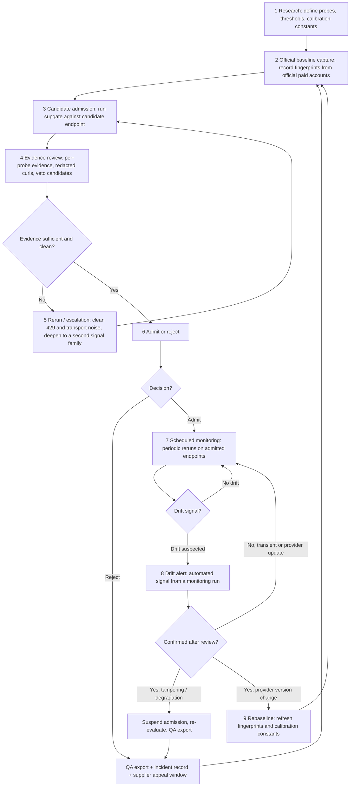
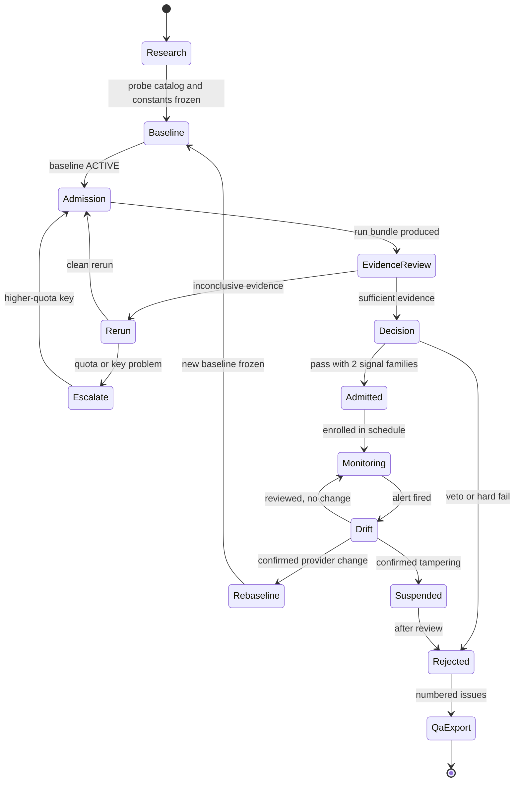
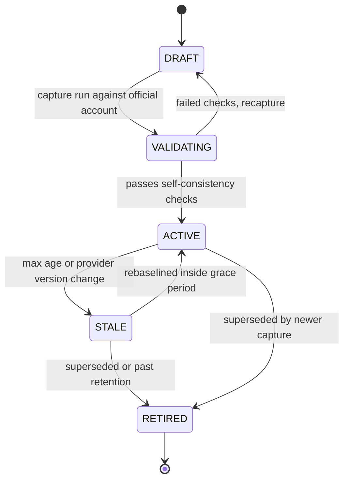
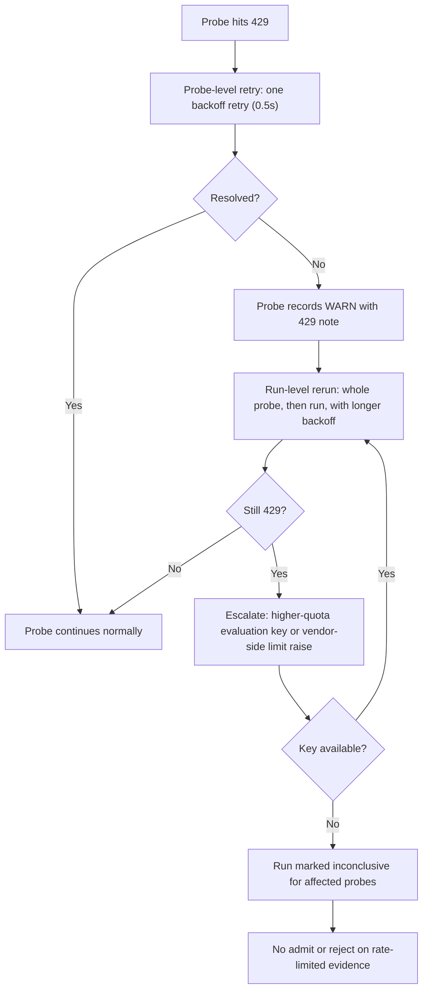
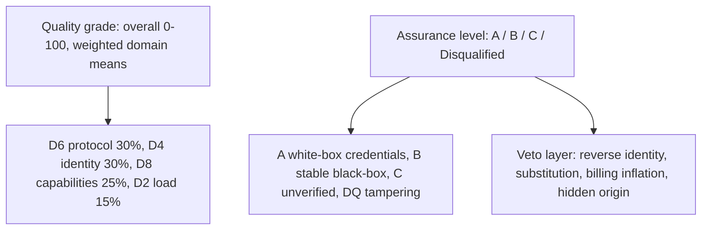
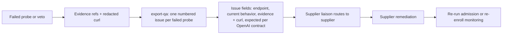

# 04 - Assurance Loop (Operational Design)

Author: ai-agent | Applies to: VERITAS (package `supgate`) | Status: design

This document is the operational design for the continuous assurance loop that
wraps the `supgate` run engine: how research becomes official baselines, how a
candidate supplier is admitted, how evidence is reviewed and appealed, how
admitted endpoints are monitored, and how drift returns to a rebaseline. It
mirrors build plan sections 7, 8, and 9 and turns them into a runnable ops loop.

References to code are to the current M1 tree: `supgate/models.py`,
`supgate/scoring.py`, `supgate/orchestrator.py`, `supgate/evidence.py`,
`supgate/store.py`, and `supgate/manifests/probes.yaml`.

---

## 4.1 Purpose

The value of VERITAS is not a single report; it is a **repeatable loop** that
keeps every upstream supplier's identity, capability, and billing claim
continuously verified. A one-off admission run decays: providers change
versions, relays re-point, and mixed routing can start after admission. The
loop converts one-off evidence into durable, monitored assurance.

Design goals:

1. **Every conclusion is reproducible.** Any admit, reject, or drift verdict
   must point at evidence refs and a redacted reproducible curl.
2. **No false accusations.** A conclusion of tampering needs independent signal
   families and a review step (see 4.7 and 4.10).
3. **Rate-limit noise is not proof.** 429/5xx never fails a probe silently and
   never drives an admit/reject decision by itself (4.9).
4. **The harness is accountable to SLOs too** (4.14).

---

## 4.2 The Loop

The operational spine, in the required order:

**research -> official baseline capture -> candidate admission -> evidence
review -> rerun/escalation -> admit/reject -> scheduled monitoring -> drift
alert -> rebaseline**

Reading guide:

- Steps 1-2 run once per vendor/model family and are refreshed on rebaseline.
- Steps 3-6 are the **admission gate** (on demand, per candidate).
- Steps 7-9 are the **monitoring loop** (continuous, per admitted endpoint).
- Any reject, suspension, or confirmed drift funnels into QA export (4.12).

---

## 4.3 Candidate Lifecycle State Machine

State semantics:

| State | Meaning | Exit conditions |
| --- | --- | --- |
| Research | Probes and constants being designed | Catalog + calibration constants frozen |
| Baseline | Official fingerprints recorded/refreshing | Baseline reaches ACTIVE |
| Admission | Candidate run requested or in flight | Bundle produced |
| EvidenceReview | Bundle examined by a reviewer | Sufficient, or routed to Rerun |
| Rerun | Probe/run repeated to remove noise | Clean run, or Escalate |
| Escalate | Quota/key issue blocks a verdict | Higher-quota key, or run marked inconclusive |
| Decision | Admit vs reject evaluated | Admitted or Rejected |
| Admitted | Supplier live in Model Square | Drift alert, or manual review |
| Monitoring | Scheduled reruns against the endpoint | Drift alert |
| Drift | Alert triaged | Confirmed change, no change, or tampering |
| Suspended | Tampering suspected, access re-evaluated | Review resolution |
| Rejected | Not admitted / removed | Supplier remediation re-admission |
| Rebaseline | Fingerprints refreshed | New ACTIVE baseline |

---

## 4.4 Roles

| Role | Typical holder | Core responsibilities | Decision power |
| --- | --- | --- | --- |
| Harness owner | Platform/SRE | Runs the schedule, owns keys and budgets, monitors harness SLOs | Suspend a run, rotate keys |
| Probe author | QA engineer | Designs/validates probes, owns calibration constants and guardrails | Propose probe changes |
| Run operator | QA engineer | Triggers admission/monitoring runs, triages 429/quota | Approve reruns |
| Evidence reviewer | QA lead | Reviews bundles and evidence, applies the two-family rule | Admit / reject recommendation |
| Decision owner | Procurement / QA lead | Makes the final admit/reject call from reviewer evidence | Final admit / reject |
| Commercial reviewer | Procurement / Vincent | Converts assurance levels into commercial evidence; reviews partner-facing reports | Release external reports |
| Supplier liaison | Account manager | Runs the appeal window, routes QA issues to suppliers | Reopen a case |

RACI for the core activities:

| Activity | Probe author | Run operator | Evidence reviewer | Decision owner | Harness owner |
| --- | --- | --- | --- | --- | --- |
| Freeze probe catalog / constants | R | C | A | I | C |
| Capture / validate baseline | C | R | C | I | A |
| Run admission | C | R | C | I | C |
| Review evidence | C | C | R | A | I |
| Rerun / escalate | C | R | A | I | C |
| Admit / reject | C | I | R | A | I |
| Enroll scheduled monitoring | I | C | C | I | R |
| Triage drift alert | C | C | R | A | R |
| Rebaseline | C | R | C | I | A |
| QA export / appeal | I | C | R | A | C |

R = responsible, A = accountable, C = consulted, I = informed.

Hard rule: **the person who authors a probe may not be the sole approver of a
reject that the probe triggers.** Reject and suspension decisions need an
evidence reviewer plus the decision owner; a veto alone is never a final
rejection until review (4.10).

---

## 4.5 Cadence

| Activity | Cadence | Trigger |
| --- | --- | --- |
| Research / probe updates | Continuous, per milestone | New signal idea, post-incident |
| Baseline capture | Per model version / provider release, and on confirmed drift | Rebaseline trigger (4.13) |
| Candidate admission (on demand) | As candidates present | New supplier, re-admission after remediation |
| Evidence review | Within 2 business days of a full run | Run bundle produced |
| Scheduled monitoring | Daily for production endpoints; weekly for low-churn; 7-day watch after an incident | Enrollment after admit |
| Drift alert triage | Within the alert SLO (4.14) | Automated signal |
| Rebaseline | Within 5 business days of confirmed provider version change | Rebaseline trigger |
| QA export | Immediately after reject / suspension | Reject, suspension, confirmed tampering |
| Retention purge | Quarterly | Retention policy (4.13) |

Monitoring tier rules:

| Tier | Candidate examples | Cadence | Budget cap | On drift |
| --- | --- | --- | --- | --- |
| Production | Endpoints in Model Square serving customers | Daily | full-mode cap | Immediate triage, suspend on tampering |
| Watch | Post-incident or post-change endpoints | Daily for 7 days, then tier | full-mode cap | Immediate triage |
| Standard | Long-stable low-churn suppliers | Weekly | full-mode cap | Triage within 24h |
| Adhoc-only | Evaluation candidates | None until admission | adhoc cap | Not enrolled |

---

## 4.6 Baseline Lifecycle

Baselines are the ground truth the loop compares against. They are recorded
from **official paid accounts** (the vendor's own endpoint), not from a
supplier's claim. Stored under `baselines/` plus the reserved `baselines` table
targeted for `supgate/store.py`, using the schema-v2 file and table contract in
`docs/08-output-data-contract.md` sections 10-11.

Stage rules:

| Stage | Allowed use | Blocked use |
| --- | --- | --- |
| DRAFT | None | Not referenced by scoring |
| VALIDATING | Development comparison only | Admission/monitoring |
| ACTIVE | Admission, monitoring, recalibration | None |
| STALE | Drift comparison for 30-day grace | New B-level admissions |
| RETIRED | Archive only | All live decisions |

Baseline contents per vendor/model family:

- `id_prefix` patterns and header fingerprints (`d4.id_prefix`, `d4.headers_diff`)
- model echo / alias map and its stability (`d4.model_echo`)
- canary behavior (`d4.canary_echo`) and SSE timing statistics (`d4.sse_timing`)
- tokenizer recount tolerance per family (`d4.recount_deviation`)
- wrap-offset threshold and reasoning-token rules (`d4.wrap_offset`, `d4.reasoning_cache_fields`)
- knowledge-boundary battery results (`d8.cutoff_battery`, `auth.kbf_battery`)
- RNG divergence cutoff (`auth.rng_fingerprint`) and LLMmap reference vectors (`auth.llmmap`)

A baseline is only ACTIVE when it carries a golden bundle: a frozen run bundle
plus its evidence directory that replay tests must reproduce exactly
(see 09-testing-validation-plan.md).

---

## 4.7 Two-Independent-Signal-Family Requirement

From build plan section 3: **"suspected substitution" and "confirmed
tampering" each require 2 independent signal families.** A single family can
only ever produce "consistent" or "unverified", never "suspected" or
"confirmed".

Signal families (six, from build plan section 3):

| # | Family | Probes |
| --- | --- | --- |
| F1 | Protocol/fingerprint mismatches | d4.headers_diff, d4.id_prefix, d4.model_echo |
| F2 | Knowledge-boundary probes | d8.cutoff_battery, auth.kbf_battery |
| F3 | Behavioral/statistical fingerprints | auth.rng_fingerprint, auth.logprob_audit, auth.llmmap |
| F4 | Capability contracts | d8.tools_gpt, d8.structured_strict, d8.reasoning |
| F5 | Billing forensics | d4.recount_deviation, d4.wrap_offset, d4.reasoning_cache_fields |
| F6 | Needle recall | d2.needle_recall |

Verdict rules:

| Conclusion | Required evidence |
| --- | --- |
| Consistent | Single family clean, no veto candidate |
| Unverified | No D4/D8 evidence (assurance stays C) |
| Suspected substitution | Signals from **at least 2 distinct families**, each with evidence refs, reviewed |
| Confirmed tampering | An **authenticity label**, not a veto code: the 2-family rule plus corroboration. Tamper/canary evidence alone is never a confirmation and never a standalone veto. |
| Inconclusive | Evidence insufficient or conflicting (for example >25% of probes rate-limited); bundle records `inconclusive: true` with a basis (schema v2) |
| Disqualified | Any of the four veto codes (`reverse_identity`, `substitution`, `billing_inflation`, `hidden_origin`) after review (veto layer in `scoring.py`). Tamper/canary evidence alone is not a veto. |

Veto codes are exactly four: `reverse_identity`, `substitution`,
`billing_inflation`, `hidden_origin`. Tamper/canary evidence (for example
`d4.canary_echo` asymmetry) corroborates a `confirmed_tampering` authenticity
label but never vetoes by itself. Independently proven calibrated billing
inflation may trigger the `billing_inflation` veto without any identity-family
label.

Authenticity verdicts carry `confidence` and `signal_families`, and an
`inconclusive` flag/basis records insufficient evidence; they serialize in the
bundle per schema 2 in `docs/08-output-data-contract.md`.

A veto (`Veto` model in `supgate/models.py`) is only attached when the reviewer
can cite at least one evidence ref per supporting family. The veto layer is
score-independent: `scoring.assurance()` returns Disqualified the moment any
veto is present, regardless of the overall score.

---

## 4.8 Mixed-Routing Confirmation

Mixed routing (A/B mixing behind one model name) is high-value but easy to
mis-detect from a single observation, so it gets a confirmation protocol.

Primary signal: `auth.mixed_routing` - same prompt x30 at temperature 0,
clustered on id prefix, response headers, latency, token counts, and text
similarity. Supporting signal: `d6.idempotency` (already implemented in M1)
flags completion-length variance at temperature 0.

Confirmation protocol:

1. First run shows 2+ distinct stable clusters with >= 3 samples each and a
   structural or latency gap between them.
2. A second run on a different day reproduces the same clusters with >= 5
   samples per cluster.
3. At least one probe from a second signal family corroborates (for example,
   `d4.model_echo` instability, or `auth.rng_fingerprint` divergence between
   clusters).

Only then is the conclusion "suspected mixed routing". One run, or one
observation per cluster, is "suspected mixing, needs confirmation" and routes
to Rerun, never to a decision.

---

## 4.9 429 / Quota Escalation

Current code already encodes the base policy: one backoff retry on 429/5xx,
then an explicit WARN (never a silent FAIL) - see `request_with_retry` in
`supgate/probes/base.py`, `_sample` in `supgate/registry.py`, and
`probe_result_with_warn`. The ops loop extends it into a ladder.

Policy rules:

1. 429/5xx after retry is always a WARN with the reason in notes - never a
   silent FAIL, never a veto. Transport errors are the exception: a
   connection/TLS/timeout failure is hard evidence the endpoint is not
   serving, keeps the probe FAIL (`probe_result_with_warn` with
   `transport_failures=True`), and a dead `p0.echo` flips the exit code to 2.
2. A probe that is WARN solely because of 429 contributes its WARN score to the
   domain, but **cannot by itself support or block an admission decision**.
3. If more than 25% of a run's probes are 429-blocked, the run is labeled
   `inconclusive` in the bundle; the decision is deferred and a retry due date
   is set.
4. Escalation uses a higher-quota evaluation key. **Never reuse an official
   paid key to probe third-party suppliers** (key hygiene, 4.13/4.14).
5. Two consecutive inconclusive runs against the same candidate trigger a
   quota escalation ticket to the harness owner and supplier liaison.

---

## 4.10 False-Accusation Guardrails

Providers legitimately update, quantize, A/B, or re-route. The loop is built so
that normal provider behavior does not read as tampering.

1. **Calibrated verdicts, never binary.** Output is always a conclusion with
   confidence (consistent / suspected / confirmed), plus the reproducible
   evidence behind it. "Distilled: yes/no" is not a supported output.
2. **Two-family rule (4.7).** "Suspected substitution" and "confirmed
   tampering" each need 2 independent families; a single strong signal
   triggers deeper investigation, not an accusation.
3. **Evidence-first.** Every failure carries an evidence ref and a redacted,
   reproducible curl; an accusation without a curl is invalid by construction.
4. **Rebaseline per model version.** A provider version bump can mimic a
   substitute's boundary; confirm version change before trusting a knowledge
   or RNG delta.
5. **Transient vs durable.** Distinguish time-of-day, load, and A/B-window
   effects from durable change (re-run across days before confirming).
6. **Separation of duties.** Reject/suspension requires an evidence reviewer
   plus the decision owner; the probe author is consulted, not sole approver.
7. **Supplier appeal window.** Any reject or suspension opens a window (default
   5 business days) for the supplier to supply counter-evidence or a
   remediation plan before the decision is locked and commercialized.
8. **Veto discipline.** A veto is attached only when the reviewer can cite an
   evidence ref per supporting family (4.7). "Hidden origin" requires the
   origin_class / transit evidence, never a bare guess. Tamper/canary
   evidence is never a standalone veto; it only corroborates a
   `confirmed_tampering` authenticity label.
9. **429 is not absence (4.9).** Rate-limit-blocked probes never become proof
   of a broken contract.

---

## 4.11 Quality Grade vs Assurance Level

Two axes are always reported together (build plan section 7). They answer two
different questions:

- **Quality grade** (overall score, 0-100): how *well* the endpoint performs the
  verified surface. Weighted domain means (D6 30%, D4 30%, D8 25%, D2 15%) from
  `scoring.py`, normalized over the domains that actually ran.
- **Assurance level** (A/B/C/Disqualified): how *confident* we are in the
  identity and supply chain. Black-box caps at B; A needs supplier credentials
  (white-box). A is a trust statement, not a performance number.

Interpretation matrix:

| Grade | Level | Meaning | Commercial use |
| --- | --- | --- | --- |
| High | A | Verified identity (white-box), capable | Strongest commercial evidence |
| High | B | Stable black-box, identity + capabilities verified | Standard commercial evidence |
| High | C | Usable but identity unverified | Admit with monitoring, disclose |
| Low | C | Honest but unusable (fails chat/SLA) | Reject on capability, not on suspicion |
| Any | Disqualified | Tampering or broken contract | Blocked, QA export, appeal |

An endpoint can be honest yet unusable (high assurance, low grade) or usable
yet unverified (high grade, low assurance). The two numbers are never merged
into one; both are printed in the bundle and both drive different parts of the
admission decision.

Current M1 note: with D4 and D8 stubbed, assurance caps at C (black-box B
requires D4 >= 80, D8 >= 80, overall >= 70 in `scoring.assurance()`).

---

## 4.12 Incident and QA Export Path

Failed probes convert directly into the numbered-list QA issue format used by
Zevolve (build plan section 1, "QA ammunition"). The path is identical for
admission rejects and monitoring drift.

Flow:

Issue template (locked to the Zevolve submission format):

| Field | Source |
| --- | --- |
| Issue number | Sequential per export |
| Affected endpoint / URL | RunBundle.endpoint |
| Claimed model | RunBundle.claimed_models |
| Probe id and domain | ProbeResult.probe_id / .domain |
| Current behavior | One-line evidence summary from ProbeResult.notes |
| Evidence + curl | ProbeResult.evidence_ref + ProbeResult.curl |
| Expected behavior | OpenAI contract text for the probe |

Monitoring incidents additionally record: run id, signal families observed,
family count (4.7), authenticity verdict and confidence (schema v2),
severity (watch/suspend), and the appeal deadline.

---

## 4.13 Retention and Recalibration

### Retention

| Artifact | Default retention | Notes |
| --- | --- | --- |
| Run bundles (JSON) | 180 days | QA-investigated bundles: 1 year |
| Evidence directory | As long as its bundle | Redacted-only, safe to retain |
| Baselines | ACTIVE + 1 year retired | Retired baselines archived |
| History (SQLite) | Indefinite aggregates | Bundle files follow bundle retention |
| External reports | Per commercial review | Partner versions gated by commercial review |

Retention is automated quarterly. Nothing is deleted if it is the sole evidence
behind an open appeal, an open incident, or a commercial claim.

### Recalibration triggers

| Trigger | Action |
| --- | --- |
| Provider model version change | Recapture baseline, re-freeze golden bundle |
| New probe added | Run against official baseline, extend golden bundle |
| False positive/negative reported by a supplier | Investigate, adjust tolerance or probe, regenerate golden |
| Drift resolved as "provider update" | Rebaseline and log the resolution |
| Tokenizer/library change (tiktoken and similar) | Re-verify recount tolerances, update constants |
| SLA tier change | Re-run load matrix, update goodput pass bars |
| 2+ incidents in 30 days on one endpoint | Escalate tier, calibrate tighter thresholds |
| RNG/knowledge-boundary drift on the official baseline itself | Rebaseline; the official endpoint moved |

Calibration constants live in code/manifest (build plan section 10.7, "not plan
blockers"), and every change bumps the manifest version recorded in the bundle
(`versions.manifest` in `supgate/orchestrator.py`).

---

## 4.14 Harness SLOs

The loop is only as trustworthy as the harness running it, so the harness has
its own SLOs. All are measured from history store and bundle metadata.

| SLO | Target | Measured by | Owner |
| --- | --- | --- | --- |
| Evidence completeness | 100% of non-skip probes carry >= 1 evidence ref + a redacted curl | Bundle scan | Harness owner |
| Secret leak rate | 0 leaked key patterns in bundles, evidence, reports | Artifact scan (see 09) | Harness owner |
| Replay determinism | 100% of replay tests reproduce golden verdicts | Test suite | Probe author |
| Schedule availability | 99% of scheduled monitoring slots start on time | History store | Harness owner |
| Drift alert latency | Alert triaged within 15 min of a daily check | Ops log | Run operator |
| Admission decision latency | Full run + review within 2 business days | Ops log | Decision owner |
| Baseline freshness | 100% of admissions use ACTIVE baselines younger than 90 days | baselines table | Harness owner |
| 429 robustness | 0 runs abandoned by unhandled 429; probes WARN within retry budget | Run log | Run operator |
| Report regen (M4) | Bundle JSON is source of truth; HTML/PDF regenerate in < 5 min | Report test | Probe author |
| Retention compliance | Quarterly purge runs, nothing needed by open cases purged | Audit | Harness owner |

---

## 4.15 Handoffs and Open Decisions

Implemented today (M1): run engine, redacted evidence, reproducible curls,
scoring + assurance, SQLite history. Stubs that become real parts of this loop
later: `supgate baseline` (M2), `supgate export-qa` (M4), `supgate report`
(M4), and the monitoring scheduler (M6).

Open decisions (from build plan section 14) that this loop depends on:

1. Owner and cost line for official baseline accounts (OpenAI/Anthropic keys).
2. Storage home for run bundles and PDF reports.
3. Default SLA thresholds per service tier.
4. Whether M6 scheduled runs merge into the Daily Model Health Monitor or stay
   a separate trigger.

The loop above is designed so each decision slot is a configuration choice, not
a redesign.
