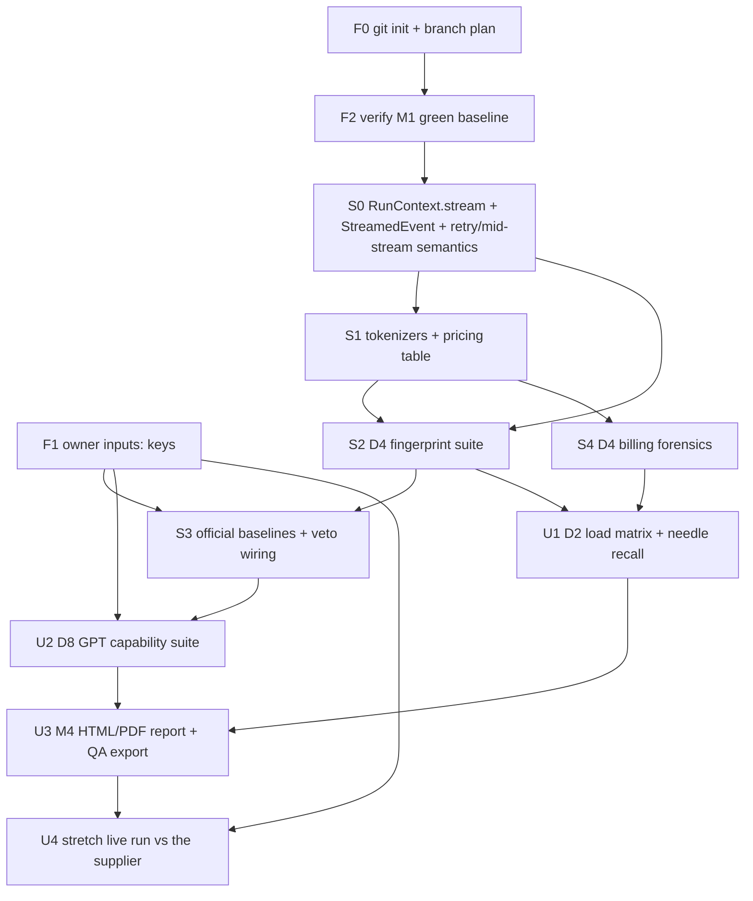

# VERITAS -- Weekend Execution Plan (Fri Aug 7 - Sun Aug 9, 2026)

Status: draft for the Fri Aug 7 - Sun Aug 9 build weekend
Base: M1 shippable (106 tests passing, ruff clean), repo at `C:\Users\rizky\Documents\VERITAS`
Owner: Rizky; commercial review: the reviewer

## 1. Goal and reality check

- **Goal:** advance from M1 (P0 + D6 only) to the M2 core: D4 fingerprints and
  billing forensics (10 of M2's 11 D4 probes), official baselines, and veto
  wiring. D2 load and D8 capability suites remain **Should**; an M4-style
  report is only a **Stretch**.
- **Reality check:** the full M2-M4 catalog cannot be perfected in two days. This plan defines must / should / stretch scope. Anything unshipped at Sunday's stop time stays unshipped and is documented as a carry-over, not a failure.
- **Exit state (minimum):** M2 (D4 fingerprints + billing, official baselines, veto wiring) landed and green on replay fixtures; the M1 branch stays shippable the whole weekend; all acceptance criteria in Section 6 are either met or explicitly recorded as blocked.
- **Working rule:** master/main always stays green. All work happens on branches. Any merge must keep the existing 106 tests passing.

## 2. Owner inputs (required by Friday evening)

| Input | Owner | Needed by | Blocks |
| --- | --- | --- | --- |
| Official OpenAI API key (baseline recording, gpt-4o family) via `SUPGATE_OPENAI_OFFICIAL_KEY` | Rizky | Fri Aug 7 | S3 baselines, veto verification, U2 cutoff battery |
| Official Anthropic API key (baseline + Claude Messages surface) via `SUPGATE_ANTHROPIC_OFFICIAL_KEY` | Rizky | Fri Aug 7 | S3 baselines, U2 claude_suite (stretch) |
| supplier evaluation key + target endpoint (api.supplier.example) | Rizky | Sun Aug 9 AM | U4 live run (stretch) |
| (Optional) one known-relay endpoint + key for the negative test | the reviewer | Sat AM | S2/S3 detection verification |
| git repo init + GitHub remote | Rizky | Fri Aug 7 | All branching, rollback, ship checklist |

Missing-key fallback is defined in Section 7 (rollback). Keys are env-only
(`--key-env`), never in argv or files. Canonical official-key env vars:
`SUPGATE_OPENAI_OFFICIAL_KEY`, `SUPGATE_ANTHROPIC_OFFICIAL_KEY`, and
`SUPGATE_OFFICIAL_BASE_URL` (overrides the vendor's well-known base URL).

## 3. Scope tiers

### Must (shipped and green by Sunday)

M2 core D4 suite: 10 probes (M2 milestone scope is 11; `d4.reasoning_cache_fields` stays M2 scope but is weekend Stretch):
- D4 fingerprint suite (7 probes): `d4.headers_diff`, `d4.id_prefix`, `d4.model_echo`, `d4.self_report`, `d4.canary_echo`, `d4.sse_timing`, `d4.rotation`.
- D4 billing forensics (3 probes): `d4.usage_presence`, `d4.recount_deviation` (tiktoken), `d4.wrap_offset`.
- Real tokenizer (tiktoken) + per-model pricing table; remove naive chars/4 budget.
- Official baselines: OpenAI + Anthropic baseline recording; `supgate baseline` command works.
- Veto wiring: reverse identity, substitution, billing inflation, hidden origin.
- Replay tests on recorded fixtures; existing 106 tests stay green.

### Should (high value, ship only if must stays green)
- D2 load matrix (3 input bands x concurrency 10, TTFT/TPOT/ITL/E2E percentiles, goodput vs SLA) + `d2.needle_recall`.
- D8 GPT capability suite: `d8.tools_gpt` x6, `d8.structured_strict`, `d8.reasoning`, `d8.cutoff_battery`, `d8.prompt_caching`.
- adhoc/full mode split becomes meaningful (D2/D8 register in the manifest).
- Assurance B reachable via a scoring unit test (not an E2E test).

### Stretch (attempt only when must + should are green)
- D4 `d4.reasoning_cache_fields` (in M2 milestone scope; weekend Stretch).
- D8 `d8.claude_suite` (Anthropic).
- M4 report: HTML rendering + PDF export + `export-qa`.
- First full report vs `api.supplier.example` (needs the supplier eval key).
- Optional `d8.swebench_lite` capability probe (see OD-09).

## 4. Dependency graph (Mermaid)

Hard edges (each edge below is a real gate; S0 is the exception, sequenced
first by plan, not by data):

- **S0 -> S1, S0 -> S2:** S0 (streaming plumbing, `06-m2-probe-spec.md` section
  3.3) is sequenced before every probe block. Its real data consumers are S2
  (`d4.sse_timing` needs per-chunk timestamps) and U1 (D2 TTFT/TPOT/ITL/E2E
  timers); the S1 edge is sequencing only.
- **S1 -> S2, S1 -> S4:** tokenizer infra lands before the fingerprint and
  billing suites; `S1 -> S4` is a hard data dependency (tiktoken feeds
  `d4.recount_deviation`).
- **S2 -> S3:** fingerprint probes feed baseline diffs.
- **S3 -> U2:** baselines feed the cutoff battery.
- **U1 -> U3, U2 -> U3:** the report needs load and capability data.
- **U4:** terminal and gated on the supplier eval key.

## 5. Work breakdown by block

### Friday evening (Fri, ~1.5h) -- prep

| ID | Task | Owner | Timebox | Output |
| --- | --- | --- | --- | --- |
| F0 | git init, GitHub remote, branch naming (`feat/m2-d4-*`) | Rizky | 20m | Repo ready |
| F1 | Confirm keys: OpenAI + Anthropic official (`SUPGATE_OPENAI_OFFICIAL_KEY`, `SUPGATE_ANTHROPIC_OFFICIAL_KEY`, base URL via `SUPGATE_OFFICIAL_BASE_URL`), supplier eval; record owners | Rizky | 20m | Key checklist; missing keys -> rollback S3/U4 |
| F2 | Verify M1: 106 tests, ruff, CLI smoke; tag `SHIPPABLE_M1` | Rizky | 20m | Green baseline tag |
| F3 | Read `10-open-decisions.md`; resolve or confirm deadline for OD-01/OD-08 | Rizky | 30m | Decisions locked for Sat |
| F4 | Dependency prep: confirm `tiktoken` + `pytest-cov` install cleanly in the venv (no `pyproject.toml` edit today - that lands with S1/S4 during the weekend); add `jinja2` + headless Chromium only if the U3 stretch is attempted | Rizky | 15m | Dependencies verified for Sat |

### Saturday (Sat, ~8-10h) -- M2 core

| ID | Task | Owner | Timebox | Output |
| --- | --- | --- | --- | --- |
| S0 | `RunContext.stream` + `StreamedEvent` + retry/mid-stream semantics (m2-spec section 3.3); transport policy locked: transport FAIL, persistent 429/5xx after one retry WARN | Rizky | 1h | `stream()` on RunContext, `StreamedEvent`, fixtures/tests |
| S1 | tiktoken + per-model pricing table; budget uses real tokens; tests | Rizky | 1h | Tokenizers module, pricing table, green tests |
| S2 | D4 fingerprint suite (7 probes) + fixtures + replay tests | Rizky | 4-6h | Probes registered in manifest, evidence-backed verdicts |
| S3 | `supgate baseline` (OpenAI/Anthropic), veto wiring, fixture verification | Rizky | 1.5h | `baselines/` records, veto codes live, Assurance B path test (scoring unit test, not E2E) |
| S4 | D4 billing: usage_presence, recount_deviation, wrap_offset | Rizky | 1.5h | Billing probes + recount/wrap tests vs fixtures |

### Sunday (Sun, ~6h)

| ID | Task | Owner | Timebox | Output |
| --- | --- | --- | --- | --- |
| U1 | D2 load matrix + needle_recall (bands, concurrency, goodput) | Rizky | 1.5h | Load probes, percentile timing, goodput vs SLA |
| U2 | D8 GPT suite: tools x6, structured_strict, reasoning, cutoff, caching | Rizky | 2h | Capability probes, skip logic, cutoff vs baselines |
| U3 | M4 report: HTML + PDF + export-qa | Rizky | 1.5h | Report render path, QA export, PDF text matches JSON |
| U4 | Full run vs `api.supplier.example` (stretch, key-gated) | Rizky + the reviewer | 1h | First live full report + manual evidence review |

## 6. Acceptance criteria per block

| Block | Acceptance criteria (all must pass unless noted) |
| --- | --- |
| S0 | `RunContext.stream` yields one `StreamedEvent` per SSE data payload with monotonic arrival timestamps; mid-stream retry follows the `request_with_retry` policy (transport stays FAIL, persistent 429/5xx after one retry WARN); evidence captured once at stream end |
| S1 | tiktoken recount matches known token counts for a fixture battery; pricing table maps claimed model -> per-1K rate; BudgetTracker no longer uses chars/4; naive-rate constant removed; 106 + new tests green |
| S2 | All 7 D4 fingerprint probes registered and scored; fixture of a stripped-header relay is flagged by `headers_diff`; `id_prefix` distinguishes `chatcmpl-` / `msg_` / vendor patterns on fixtures; canary alteration detected; rotation fixture shows multiple backends |
| S3 | `supgate baseline record --vendor openai --model gpt-4o` writes a baseline JSON under `baselines/` (docs/08 schema v2); veto fires on fixtures for reverse identity and hidden origin; billing-inflation veto fires on a +88% fixture; `baseline` no longer a CLI stub; Assurance B path is a scoring unit test, not an E2E test |
| S4 | `recount_deviation` flags a +88% inflation fixture within calibrated tolerance; `wrap_offset` detects a constant +11 offset fixture; `usage_presence` passes on non-stream and final stream chunk; 429/5xx stays Warn, not Fail |
| U1 | TTFT/TPOT/ITL/E2E P50/P90 computed from post-semaphore timers; timers start after semaphore (no load-host queueing); goodput = % requests meeting TTFT<=5s, TPOT<=500ms, E2E<=60s (client SLA overrides); needle verbatim recall pass on fixture |
| U2 | Each of the 6 tool modes passes independently on the official endpoint; `structured_strict` validates output against schema; cutoff battery matches baseline pattern on official gpt; claude_suite (Stretch only): skips cleanly on OpenAI and runs on Anthropic when attempted |
| U3 | MOK-style report reproducible end-to-end on a saved run bundle; PDF text extraction matches JSON fields; `export-qa` emits one numbered issue per failed probe in the locked submission format |
| U4 (stretch) | Full run against the supplier endpoint completes within budget; every verdict manually reviewed; redacted curls replay; no key leakage in evidence or report |

## 7. Rollback and stop conditions

- **Green-trunk rule.** master/main is always shippable M1. Any branch merge must keep the 106 (and growing) tests green. To roll back a block, revert the branch commit; the tagged `SHIPPABLE_M1` is the fallback restore point.
- **Missing-key rollback.**
  - No OpenAI/Anthropic key by Sat: S3 degrades to fixture-recorded baselines (replay only); live baseline verification is deferred and documented. OD-01 is the resolving decision.
  - No supplier eval key: U4 becomes a dry run against the fake server; no live report, and the live supplier run is a documented carry-over.
- **False-positive stop.** If any probe calls a known-clean official endpoint "confirmed tampering", STOP the block. Verify calibration constants and fixtures first; do not ship until the false positive is explained and the probe is corrected.
- **Live-run stop.** Same rule for the live supplier run: a verdict that contradicts manual evidence stops the run and triggers review before anything is exported or shared.
- **Time-box guard.** Each block has a hard timebox. Overrun drops the block to the next-lower scope tier and records the reason.
- **Cost guard.** Full runs capped at $25, adhoc at $5 (operator inputs, not CLI defaults); baseline recording is metered and logged. Hitting a budget stops probe execution (Warn "budget-blocked"), never silently skips.
- **Ship veto.** If any must-block acceptance criterion is unmet, or any stop condition triggered, the weekend ships M1 plus whatever is green, with a written carry-over list. Ship decision is Rizky's, with the reviewer for anything commercial.

## 8. Sunday ship checklist

| # | Check | Done |
| --- | --- | --- |
| 1 | All must-block acceptance criteria met (or explicitly blocked with reason) | [ ] |
| 2 | Existing 106 tests + all new tests pass (`python -m pytest -q`) | [ ] |
| 3 | `ruff check .` clean | [ ] |
| 4 | Live runs recorded in SQLite history (or documented blocker) | [ ] |
| 5 | Redaction verified: no key/token leaks in evidence, bundles, or reports | [ ] |
| 6 | `docs/10-open-decisions.md` updated: decisions resolved or owner+deadline set | [ ] |
| 7 | Carry-over list written (unshipped should/stretch items, each with owner) | [ ] |
| 8 | Rollback path documented (branch names, `SHIPPABLE_M1` tag) | [ ] |
| 9 | Ship decision recorded (ship / ship-minus / hold) by Rizky, the reviewer for commercial | [ ] |
