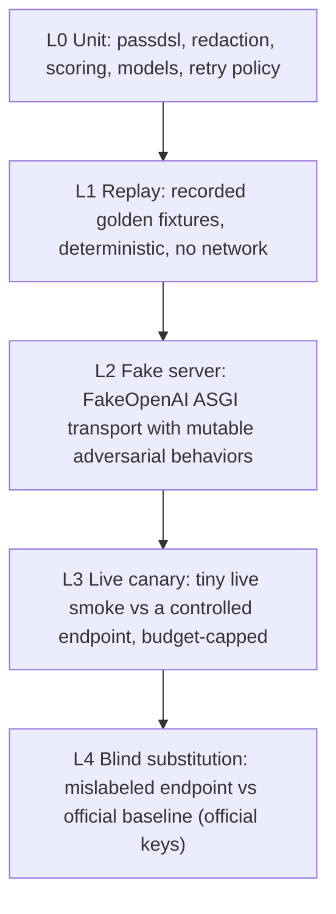

# 09 - Testing and Validation Plan

Author: ai-agent | Applies to: VERITAS (package `supgate`) | Status: design

This document defines how VERITAS proves it is correct, how it is tested at
each milestone, and how its own outputs (bundles, evidence, reports) are
validated. It maps build plan sections 8, 11, and 12 into a concrete test
architecture: a five-layer pyramid, a fixed adversarial fixture suite, golden
bundles, deterministic replay, redaction and timing audits, and acceptance
matrices for M2/M3/M4.

Grounding in the current M1 tree: tests already live in `tests/` with a shared
`conftest.py`, a hand-rolled `tests/fake_server.py` (`FakeOpenAI` ASGI app),
and suites covering evidence redaction, scoring, registry, orchestrator, CLI,
pass DSL, and output contract. This plan extends those conventions rather than
replacing them. M1 baseline: 106 tests passing, 14 probes (3 P0 + 11 D6).

---

## 9.1 Test Pyramid

| Layer | Covers | Network | Official keys | Runs in CI | Owner |
| --- | --- | --- | --- | --- | --- |
| L0 Unit | Pure logic: pass DSL evaluation, secret redaction, scoring math, assurance mapping, retry/WARN policy, manifest validation | No | No | Always | Probe author |
| L1 Replay | Deterministic reproduction of recorded runs: same fixtures in, identical verdicts and report numbers out | No | No | Always | Probe author |
| L2 Fake server | End-to-end orchestrator + probe behavior against `FakeOpenAI` with mutable faults (429, 5xx, wrong key, disabled surfaces) | No | No | Always | Probe author |
| L3 Live canary | Small live smoke against a controlled OpenAI-compatible endpoint to catch real-world drift the fakes miss | Yes (controlled, tiny) | No | Never (opt-in `-m live`) | Run operator |
| L4 Blind substitution | The M5 acceptance: one deliberately mislabeled endpoint vs official baseline; the tool must flag it | Yes | Yes | Never (manual, gated) | Decision owner |

Golden rule: **the default test suite must pass with zero network access and
zero paid keys.** Layers L3 and L4 are physically separated (9.13) and can never
break CI.

---

## 9.2 Layer Detail

### 9.2.1 L0 Unit

Directly exercise pure modules with no fixtures:

- `passdsl.py`: parser correctness, precedence (`and`/`or`/`not`,
  parentheses), every registered function (`json_parses`, `has_keys`,
  `content_contains`, `finish_reason`, `choices`, `error_object`,
  `usage_consistent`, `no_tool_calls`), and `PassEvalError` on malformed input.
- `evidence.py`: redaction invariants (9.8) - key/bearer/header/URL handling.
- `scoring.py`: weighted domain means, overall normalization, skip handling,
  assurance A/B/C/Disqualified mapping, veto override.
- `models.py`: `BudgetTracker` math, `SLA` conversions, verdict enum round-trips.
- `probes/base.py`: `request_with_retry` 429/5xx->WARN policy (transport
  errors stay FAIL), `probe_result`/`probe_result_with_warn` verdict logic.
- `registry.py`: manifest loading, `samples == sum(case samples)` validation,
  unknown-runner rejection, placeholder substitution.
- `store.py`: history insert/query and schema idempotence.

### 9.2.2 L1 Replay

Replay recorded request/response exchanges (the same JSON documents the
`EvidenceWriter` produces) through the full scoring + report path. No HTTP.
Goals:

- Golden bundle parity: replay of a recorded bundle reproduces identical
  per-probe verdicts, domain scores, overall score, assurance, and verdict
  counts (9.6).
- Regression lock: a change that shifts a recorded verdict fails loudly.
- Determinism: seeded RNG and injectable clock/run id make output byte-stable
  (9.7).

### 9.2.3 L2 Fake Server

The existing `FakeOpenAI` ASGI app behind `httpx.ASGITransport` is the workhorse
for end-to-end orchestrator tests. Mutable behaviors already supported:
valid/wrong key, force 429, force 5xx, disabled Responses API, disabled vision,
model catalog, id prefix, request log. Extend it for the adversarial cases in
9.4 (relay proxy, mislabeled model, billing inflation, wrapper offset, mixed
routing, fake SSE).

The request log (`FakeOpenAI.requests_log`) doubles as an assertion surface:
tests verify exactly what supgate sent (headers, bodies, stream flags), which
is also how the "no internal fingerprint leaks" self-check is asserted.

### 9.2.4 L3 Live Canary

A live smoke run against a controlled endpoint (local vLLM, a private gateway,
or any OpenAI-compatible endpoint the operator controls) with tiny budgets.
Purpose: validate real transport behavior that ASGI fakes cannot (TLS, real
chunking, real headers) without spending on official models.

- Always budget-capped (suggested USD 0.50), always `--mode adhoc`, never
  pointed at a supplier without explicit sign-off.
- Executed via `pytest -m live` or the CLI directly; never in CI (9.12).
- The canary endpoint is not a supplier under evaluation; it is harness
  verification.

### 9.2.5 L4 Blind Substitution

The acceptance test for M5: two endpoints, one deliberately mislabeled
(serving model B under model A's name), and the tool must flag the mislabeled
one using the two-independent-signal-family rule (04-assurance-loop.md 4.7).

- Requires official baseline keys (9.13) to record the reference fingerprints
  and to build the mislabeled endpoint fixture.
- Run manually, results recorded as a golden bundle plus a written verdict.
- Pass criterion: the tool reports "suspected substitution" or "confirmed
  tampering" for the mislabeled endpoint and "consistent" for the clean one,
  each with a stated confidence and the supporting signal families (schema v2
  `authenticity: {verdict, confidence, signal_families}`).

---

## 9.3 Required Fixtures

| Fixture | Kind | Used by | Location (proposed) |
| --- | --- | --- | --- |
| `FakeOpenAI` ASGI app | Code | L2 | `tests/fake_server.py` (exists) |
| `transport` / `client` / `ctx` / `orchestrator` | Code | L2 | `tests/conftest.py` (exists) |
| SSE body builders (correct, malformed, buffered-fake, include_usage) | Code | L2/L1 | `tests/sse_fixtures.py` |
| Relay proxy ASGI app (header strip/rewrite, id rewrite) | Code | L2 adversarial | `tests/relay_proxy.py` |
| Mislabeled model backend | Code | L2/L4 | `tests/mislabeled_server.py` |
| Baseline injection fixture (official-family fingerprints for reverse-identity tests) | Code | L2 | `tests/baseline_injector.py` |
| Billing manipulator (usage inflation, wrap offset; MOK-calibrated +88% recount and +11-token offset) | Code | L2 | `tests/billing_manipulator.py` |
| Mixed router (round-robin across two backends) | Code | L2 | `tests/mixed_router.py` |
| Golden bundles (official clean, relay, mislabeled, billing, wrap, mixed, 429) | Data | L1 | `tests/golden/` |
| Recorded evidence exchange JSON | Data | L1 | `tests/golden/<run>/evidence/` |
| Error contract JSON (401/400 OpenAI-style) | Data | L0/L2 | `tests/fixtures/errors/` |
| 429/5xx response JSON | Data | L2 | `tests/fixtures/errors/` |
| Baseline samples (id prefixes, header diffs, recount tolerances) | Data | L1/L2 | `tests/fixtures/baselines/` |
| Redaction corpus (keys, bearer tokens, custom headers, sensitive query values, `sk-` patterns in URL path) | Data | L0 | `tests/fixtures/redaction/` |

Every golden bundle is content-hash pinned (9.6); a hash change means the
fixture changed and the affected tests must be reviewed, not blindly updated.

---

## 9.4 Controlled Adversarial Cases

Each case is a small, reproducible scenario with a defined expected outcome.
They are the heart of M2-M5 validation: they prove the tool detects a specific
failure mode and that it does not false-accuse the clean variants.

| Case | Scenario | Expected probe outcome | Guardrail verified |
| --- | --- | --- | --- |
| Clean relay | Transparent ASGI proxy in front of `FakeOpenAI` that only forwards | No vetoes; D4 neutral or "consistent"; assurance at most B, not Disqualified | Relaying is neutral, tampering is penalized (build plan section 2) |
| Header-stripping relay | Proxy strips/rewrites response headers | `d4.headers_diff` fails vs baseline | Cheap relay evidence detected |
| Id-rewrite relay | Proxy changes `chatcmpl-` prefix to a vendor prefix | `d4.id_prefix` flags mismatch; relay not inferred as model identity | Protocol/fingerprint family (F1) |
| Mislabeled model | Backend serves a small/old model under a claimed name | `d8.cutoff_battery` + `auth.rng_fingerprint` diverge -> 2 families -> suspected substitution | Two-family rule (F2 + F3) |
| Reverse identity | Baseline-injected official-family fingerprints served under a different claimed name | `d4.id_prefix` + `d4.self_report` agree -> `reverse_identity` veto | Protocol/fingerprint family (F1); baseline-injection fixture |
| Capability collapse | Backend fails tools/structured output wholesale | `d8.tools_gpt`/`d8.structured_strict` fail; corroborates substitution | Capability family (F4) |
| Billing inflation | Reported `prompt_tokens` inflated to the MOK-calibrated +88% (boundary fixtures retain the ~15% tolerance edge) | `d4.recount_deviation` exceeds tolerance -> `billing_inflation` veto, no identity-family label needed | Billing family (F5) |
| Wrapper offset | Constant +11-token offset (reported - recount) across prompt sizes (MOK-calibrated; boundary fixtures retain sub-threshold offsets) | `d4.wrap_offset` over threshold -> hidden-injected-prompt evidence; corroborates `hidden_origin`/`billing_inflation`, never a veto on its own | Billing family (F5) |
| Mixed routing | Round-robin across two backends (different id prefixes, latency clusters) | `auth.mixed_routing` shows 2+ clusters; `d6.idempotency` variance; needs confirmation run | Mixed-routing confirmation (04 4.8) |
| Rate limit | Server force_429 | All affected probes WARN, never FAIL; run flagged inconclusive if > 25% blocked | 429 policy (04 4.9) |
| Fake SSE (buffered) | Uniform burst of chunks after a long stall | `d4.sse_timing` flags buffered stream; `d6.chat.sse` still passes (frames valid) | Fake streaming is not protocol failure |
| Malformed SSE | Missing `[DONE]`, garbage frames | `d6.chat.sse` fails | Protocol compliance is real |
| Disabled surfaces | Responses API / vision / Claude Messages absent | Affected probes SKIP cleanly, domains not zeroed | Skipped != failed (build plan section 2) |

Veto codes are exactly `reverse_identity`, `substitution`,
`billing_inflation`, `hidden_origin`. Tamper/canary evidence (for example
canary-echo asymmetry) corroborates a `confirmed_tampering` authenticity label
but is never a standalone veto; no adversarial case expects a veto from canary
evidence alone.

Each adversarial case ships as both a code fixture (L2) and a recorded golden
bundle (L1), so the behavior is locked twice: once live against the fault
injector, once deterministically against the recording.

---

## 9.5 Golden Bundles

A golden bundle is a frozen `RunBundle` JSON plus its `evidence/` directory,
captured from a controlled scenario and committed under `tests/golden/`.

Canonical set:

| Golden id | Scenario | Expected verdict summary |
| --- | --- | --- |
| `g_official_clean` | `FakeOpenAI` as the "official" endpoint, full mode | Pass across D6; no vetoes; assurance B when D4/D8 fixtures present |
| `g_clean_relay` | Transparent relay | Pass; relay neutral; no vetoes |
| `g_header_strip` | Header-stripping relay | `d4.headers_diff` fail |
| `g_id_rewrite` | Id-rewrite relay | `d4.id_prefix` fail |
| `g_mislabeled` | Mislabeled model backend | Suspected substitution, 2+ families |
| `g_billing_inflation` | Billing inflator (MOK +88% recount) | `billing_inflation` veto -> Disqualified, no identity family required |
| `g_wrap_offset` | Wrapper-offset backend (+11-token offset) | `wrap_offset` corroborates; Disqualified only via a veto code (e.g. `hidden_origin` with `recount_deviation`), never on `wrap_offset` alone |
| `g_mixed_routing` | Mixed router | 2+ clusters, needs confirmation |
| `g_reverse_identity` | Baseline-injected official family under a foreign claim | `reverse_identity` veto -> Disqualified |
| `g_rate_limited` | 429 storm | WARNs, run inconclusive flag |
| `g_fake_sse` | Buffered fake stream | `sse_timing` fail, `d6.chat.sse` pass |

Each golden bundle records, alongside the bundle, a `MANIFEST.json` with the
supgate version, manifest version, scenario description, and content hashes of
every file. Regeneration is a dedicated command that bumps the manifest and
requires a reviewed diff; it is never a silent test fix.

---

## 9.6 Deterministic Replay

Replay tests (L1) re-run the scoring and report path over recorded evidence and
assert exact parity with the golden bundle:

- Per-probe verdict, score, successes/attempts, evidence refs.
- Domain scores and overall score (exact, not rounded).
- Assurance level and basis; veto list.
- Authenticity verdict, confidence, signal_families, and the `inconclusive`
  state when present (schema v2).
- Verdict counts in the summary line.
- Bundle-to-report numbers (9.10).

Determinism requirements:

1. No network: replay constructs probe results from recorded evidence.
2. Injectable run id and clock: `secrets.token_hex` and `datetime.now(UTC)` in
   `supgate/orchestrator.py` are replaced by injected values for replay, so
   byte-stable output is achievable.
3. Seeded RNG for any probe that samples (idempotency and future
   fingerprint/RNG probes) so clustering and distributions are reproducible.
4. A 100% replay parity target; any mismatch fails the suite (SLO in
   04-assurance-loop.md 4.14).

---

## 9.7 Evidence-Redaction Tests

The existing `tests/test_evidence.py` covers the unit invariants. This plan
extends them to an artifact-level audit:

Invariants (each is a test):

1. `sk-...` keys and bearer tokens never appear in any bundle, evidence file,
   or report artifact.
2. `Authorization` header becomes `Bearer $SUPGATE_KEY`; custom auth headers
   (`x-api-key`, `access-token`, and the header regex set in
   `supgate/evidence.py`) become `$SUPGATE_KEY`.
3. Sensitive URL query values become `$SUPGATE_KEY`; `sk-`-style strings in
   the URL path are redacted. Fragment redaction is claimed only for exact
   `sk-`-pattern matches, never for arbitrary fragment secrets.
4. Every request body's secrets are recursively redacted.
5. Reproducible curl: the stored curl replays the request when `$SUPGATE_KEY`
   is set to the real key, without ever printing the key.
6. Response bodies are redacted too (a leaked key in a response is as bad as in
   a request).

Scope note: the current guarantee is exactly sensitive query values, auth
headers, and `sk-`-style strings in URL/path. This plan does not claim
arbitrary fragment-secret redaction beyond exact `sk-` pattern matches.

Audit gate: a helper scans a produced run directory (bundle + evidence) for the
redaction corpus and any `sk-` pattern; it runs as a test over the L2 runs and
as a pre-release check over live-run artifacts (9.12).

---

## 9.8 Performance-Timer Validation

Timing is evidence for D2 and D4 (`d4.sse_timing`), so the timers themselves
are tested:

- `RunContext.request` records per-exchange duration via `time.perf_counter`
  (already the case in `supgate/probes/base.py`); tests assert a sample is
  recorded for every request, including transport-error attempts.
- Timing starts after the semaphore is acquired (build plan section 5) - tests
  assert queueing behind a saturated fake server does not inflate samples.
- TPOT/ITL exclude the first token (build plan section 5): timer aggregation
  tests assert the first-chunk timing is excluded from per-token metrics.
- P50/P90 computation over a known sample set is unit-tested (D2 milestones).
- A controlled delay fixture (configurable `asyncio.sleep` in `FakeOpenAI`)
  verifies recorded TTFT/E2E are within a tolerance band of the injected delay.
- Fake-SSE inter-chunk timing: `d4.sse_timing` must classify an injected
  uniform-burst body as buffered and a naturally paced body as organic.

---

## 9.9 Report JSON/PDF Text Consistency (M4)

When the HTML/PDF report lands (M4), the JSON bundle stays the source of truth.
Consistency tests render the report, extract its text (headless Chromium +
`pdftotext` or the PDF Export Style Guide toolchain), and assert:

- Overall score, domain scores, and assurance level match the bundle exactly.
- Every probe id and verdict appears in the per-probe detail section.
- Veto list, if any, is reproduced verbatim.
- Evidence refs and redacted curls appear in the appendix.
- No `sk-` secret appears in the extracted text (redaction audit over the
  rendered artifact).

The report is a derivation: any divergence is a report bug, not a bundle bug.

---

## 9.10 Milestone Acceptance Matrices

### M2 - Fingerprints and billing

| Acceptance (build plan section 8) | Test | Fixture |
| --- | --- | --- |
| `baseline` command records fingerprints | L0/L2: baseline capture + validate against `FakeOpenAI` as official account | `tests/golden/g_official_clean`, `tests/fixtures/baselines/` |
| Relay is detected | L2 adversarial | `tests/relay_proxy.py` |
| Official is clean | L2 + golden | `g_official_clean` |
| Redacted curl repro works | L0 + L2 | redaction corpus |
| Reverse identity detected | L2 adversarial | `tests/baseline_injector.py` |
| Billing inflation detected (MOK +88%) | L2 adversarial | `tests/billing_manipulator.py` |
| Wrap offset detected (MOK +11-token offset) | L2 adversarial | `tests/billing_manipulator.py` |
| Veto wiring disqualified on real signal | L0 scoring + L2 bundle | `g_reverse_identity`, `g_billing_inflation`, `g_wrap_offset` |

### M3 - Load and capabilities

| Acceptance | Test | Fixture |
| --- | --- | --- |
| TTFT/TPOT compare vs manual curl timings | 9.8 timer validation | controlled delay in `FakeOpenAI` |
| Capability matrix matches known model capabilities | L2 capability backends (tools/structured/reasoning pass/fail) | `tests/capability_backends.py` |
| Skip logic caps skips so domains are not zeroed | L2 disabled-surface tests | `FakeOpenAI` toggles |
| Load matrix goodput vs SLA | L2 load band runs with injected latencies | `tests/load_server.py` |

### M4 - Scoring and report

| Acceptance | Test | Fixture |
| --- | --- | --- |
| Reproduce a MOK-style report end to end | L1 golden render + 9.9 | `tests/golden/*` |
| Extract PDF text and check vs JSON | 9.9 consistency tests | rendered report artifacts |
| QA issue export in locked format | L0/L2: `export-qa` on a failed golden bundle | `g_mislabeled`, `g_rate_limited` |

### M5 - Blind substitution (acceptance, requires official keys)

| Acceptance | Test | Fixture |
| --- | --- | --- |
| Two endpoints, one deliberately mislabeled, tool flags it | L4 blind substitution | official baselines + mislabeled endpoint |

---

## 9.11 Coverage and Quality Gates

Quality gates apply to every milestone and to CI:

| Gate | Command / rule | Fails when |
| --- | --- | --- |
| Test suite | `.\.venv\Scripts\python.exe -m pytest -q` | Any non-live test fails |
| Lint | `.\.venv\Scripts\python.exe -m ruff check .` | Any ruff finding |
| Coverage | `pytest --cov=supgate --cov-fail-under=85` on core modules (enforced once `pytest-cov` is added to `[project.optional-dependencies] dev` on Friday) | Below 85% line coverage on `evidence`, `scoring`, `passdsl`, `registry`, `orchestrator`, `models` |
| Compile | `python -m compileall supgate` | Bytecode failure |
| Dependencies | `python -m pip check` | Broken dependency graph |
| Secret scan | Redaction audit over test-produced runs (9.7) | Any leaked key pattern |
| Golden parity | Replay suite (9.6) | Any divergence from golden bundles |
| Live isolation | `pytest -q` runs with `-m "not live"` by default | A live test running without opt-in |
| Determinism | Seeded replay twice in one run | Any run-to-run verdict difference |

`pytest-cov` is a Friday dependency, not part of the M1 dev extras; the >=85%
gate is not enforced until it is installed. Coverage runs exclude the isolated
official-key live tests (9.13), which never run in CI.

---

## 9.12 Live-Test Safety and Cost Controls

Live layers (L3/L4) are restricted by hard controls:

1. **Budget caps.** Every live run passes `--budget-usd`; suggested defaults
   `adhoc` 5, `full` 25 (build plan section 12). Exhaustion blocks further
   probes and remaining probes WARN "budget-blocked" (already in
   `supgate/orchestrator.py`).
2. **Concurrency and timeout.** `--concurrency` bounded 1..50 (default 10);
   probe timeout default 60s (already enforced).
3. **Key hygiene.** Keys are env-only via `--key-env`, never on argv
   (already enforced in `supgate/cli.py`). Official paid keys are never used to
   probe third-party suppliers; dedicated evaluation keys only.
4. **Never in CI.** Live tests require `-m live` (or `LIVE=1`) and are excluded
   by default; CI runs the offline suite only.
5. **Redaction gate after every live run.** The secret scan (9.7) runs over all
   produced artifacts before they may be stored or shared.
6. **Dry-run (M2 target, not current).** A dry-run mode prints the probe plan
   and estimated budget without sending requests. Not implemented in M1;
   today, budget exhaustion produces budget-blocked WARNs and the run
   finishes with exit code 0.
7. **Kill switch.** P0 dead aborts with exit code 2; budget exhaustion does
   not abort -- remaining probes WARN "budget-blocked" and the run finishes
   with exit code 0. Exit code 3 stays reserved for configuration errors and
   aborts, not for cost caps. An operator can abort a run mid-flight.
8. **Cost accounting.** `BudgetTracker` records requests, estimated USD, and
   blocked state into the history store for per-run cost reporting.

---

## 9.13 Tests That Require Official Paid Keys

A small, explicit set of tests needs official paid accounts. They are kept out
of the default suite and out of CI, grouped under `tests/live/` and tagged
`official`.

Required env (see build plan section 14 open decision 1):

| Env var | Purpose |
| --- | --- |
| `SUPGATE_OPENAI_OFFICIAL_KEY` | Record/validate OpenAI baseline fingerprints |
| `SUPGATE_ANTHROPIC_OFFICIAL_KEY` | Record/validate Anthropic baseline fingerprints |
| `SUPGATE_OFFICIAL_BASE_URL` | Official account base URL |

Which tests:

1. **Baseline capture validation (M2):** capture fingerprints against the
   official account and confirm self-consistency across two runs. Budget-capped
   (suggested USD 2), adhoc probes only.
2. **Baseline drift re-validation:** run once per rebaseline trigger (04 4.13).
3. **Blind substitution acceptance (M5, L4):** the two-endpoint mislabel test
   from 9.2.5, including the mislabeled fixture endpoint.

Rules:

- Skipped (not failed) when the env vars are absent or unset.
- Every one is budget-capped, time-boxed, and logged to history.
- Never automated on a schedule without a human operator present.
- Their results are recorded as golden bundles so the behavior is reproducible
  offline afterward.

Everything else - all L0/L1/L2 tests and the L3 live canary against a
controlled endpoint - runs without official paid keys.

---

## 9.14 Status vs Implementation Map

| Plan item | Where implemented (M1) | Where it lands |
| --- | --- | --- |
| Fake server | `tests/fake_server.py` | Exists; extended in 9.4 |
| Shared fixtures | `tests/conftest.py` | Exists |
| Redaction unit tests | `tests/test_evidence.py` | Exists; extended in 9.7 |
| Scoring/assurance tests | `tests/test_scoring.py` | Exists |
| Output contract tests | `tests/test_output_contract.py` | Exists |
| Golden bundles + replay | Not yet | M2, alongside baselines |
| Adversarial fixture apps | Not yet | M2 (relay/billing), M3 (load/capability), M5 (mislabel/mixed) |
| Timer validation | Partial (`_supgate_ms` set) | M3 |
| Report consistency | Not yet | M4 |
| Blind substitution | Not yet | M5 |
